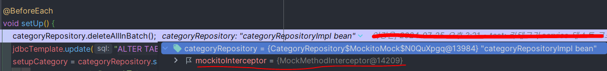

* * *

> 개발하던 중 갑자기 특정 도메인의 모든 테스트 코드가 불통이 됐다 (Service + Controller 계층)  
> 실제 서버를 실행하고 API을 호출하면 정상적으로 응답이 되는데 테스트코드를 돌릴때만 에러가 발생했다....   
> 디버깅하고 확인해보니 `@Component` + `@MockBean` 사용시 발생하는 문제였다...

원인 분석과 해결 과정을 정리 해보자.


## ✅ 원인 분석 과정

### 코드 설명

```java
// 테스트 코드 중 한 개
@DisplayName("생성 - 성공적으로 카테고리를 생성한다")
@Test
void whenCreateCategory_thenCategoryIsCreated() {
  // given
  CategoryServiceCreateReq request = CategoryServiceCreateReq.builder()
    .categoryName("카테고리")
    .categoryType(CategoryType.EXPENSE)
    .description("카테고리 설명")
    .userEmail("이메일")
    .build();

  // when
  CategoryServiceRes createdCategory = categoryService.create(request);
  Category fetchedCategory = categoryRepository.findById(createdCategory.id()).get();

  // then
  assertThat(fetchedCategory.categoryName()).isEqualTo("카테고리");
  assertThat(fetchedCategory.categoryType()).isEqualTo(CategoryType.EXPENSE);
  assertThat(fetchedCategory.description()).isEqualTo("카테고리 설명");
  assertThat(fetchedCategory.isCustom()).isTrue();
}

// Service 코드
@Transactional
public CategoryServiceRes create(CategoryServiceCreateReq request) {
  Category category = categoryRepository.save(Category.create(request));
  return CategoryServiceRes.fromDomain(category);
}

// Repository 코드
@Override
public Category save(Category category) {
  return jpaRepository.save(category.toEntity()).toDomain();
}
```
Repository와 JpaRepository가 분리되어 있는 구조라 좀 햇갈릴수도 있다.

### 📌 로그확인
로그를 확인해봐도 NPE만 터지고 별다른 특이사항을 확인할 수 없었다.  
CategoryRepository를 확인해봐도 Bean이 구현체로 정상적으로 삽입된 상태였다.... 
<br>

### 📌 테스트 코드 디버깅
테스트 코드를 디버깅해보니 `CategoryRepository`의 `save` 메소드가 호출되지 않고 `null`이 반환되는 것을 확인했다.  
<br>

### 📌 원인 분석
다른테스트 코드에서 컴포넌트로 등록하고 `@MockBean`으로 Mocking된 Bean을 주입받아 사용하고 있었다.  
`@Component` + `@MockBean` 사용시 Mocking된 Bean이 주입되어 실제 Bean이 주입되지 않는 문제가 발생했다.

```java
@Component
public class AccountTestHelper {

  @Autowired
  private AuthHelper authHelper;

  @MockBean
  private CategoryRepository categoryRepository;
}
```



<br>

##  ✅ 해결

### 📌@SpyBean 적용
SpyBean은 Stubbing을 지정해주면 해당 Sutbbing 으로 동작하고 아니면 실제 Bean처럼 동작한다.

<br><br>

### 마치며
* `@Component` + `@MockBean` 사용시 Mocking된 Bean이 주입되어 실제 Bean이 주입되지 않는 문제가 발생할 수 있다.
* 기술은 역시 잘 알고 써야한다. 테스트에서만 사용하는 컴포넌트가 저렇게 동작하여 사이드 이펙트가 발생할 줄 몰랐다.. -.-


