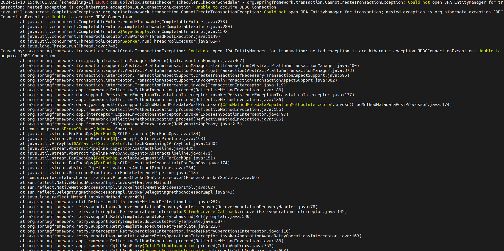

* * *

이 글은 간혈적으로 발생하던, `Tibero Connection`의 `Network Timeout ` 이슈로 문제 정의부터 해결까지의 과정을 담았습니다.

## ✅ 개발 환경
- `SpringBoot 2.6.2`
- `Tibero 6.0`
- `HikariCP 4.0.3`
- `Java 8`

<br>


## ✅ 문제 상황

### 📌 증상
서비스에서 간헐적으로 DB 연결 대기가 15분 이상 지속됐습니다.   
이 문제는 단순한 타임아웃 문제를 넘어 커넥션 점유와 성능 저하로 이어졌습니다.




<br>

### 📌 장애의 단서

1. 에러로그
```text
1. SQL Error: 0, SQLState: null

2. org.hibernate.engine.jdbc.spi.SqlExceptionHelper - HikariPool-1 - Connection is not available, request timed out after 30002ms.

3. org.springframework.transaction.CannotCreateTransactionException: Could not open JPA EntityManager for transaction; nested exception is org.hibernate.exception.JDBCConnectionException: Unable to acquire JDBC Connection
   java.util.concurrent.CompletionException: org.springframework.transaction.CannotCreateTransactionException: Could not open JPA EntityManager for transaction; nested exception is org.hibernate.exception.JDBCConnectionException: Unable to acquire JDBC Connection

4. HikariPool-1 - Connection is not available, request timed out after 949905ms.
```

<br>


### 📌 접근

1. `HikariCP DeadLock` 의심  
- HikariCP + JPA (GenerationType.SEQUENCE, AUTO) 사용 시 DeadLock 발생 가능성이 있습니다.
- 메시지 1개를 저장하는데 한 Transaction에서 동시에 Connection 2개를 사용하면서 HikariCP DeadLock이 발생할 수 있습니다.


Connection 개수가 2개라고 가정할 때 다음과 같은 시나리오로 Dead Lock이 발생할 수 있습니다. 
```text
1. (Thread-1) 트랜잭션 시작 (Connection A)
2. (Thread-2) 트랜잭션 시작 (Connection B)

3. (Thread-1) ID 채번을 위한 Sequence 조회 (Connection Wait)
4. (Thread-2) ID 채번을 위한 Sequence 조회 (Connection Wait)
```
좀 더 자세하게 설명을 하겠습니다.

```text
1. (Thread-1) Connection A를 획득하고 트랜잭션을 시작합니다.
   - Thread-1이 HikariCP Pool에서 Connection A를 점유합니다.
   - 이 Connection은 Thread-1의 트랜잭션 작업에 사용되고 있으며, 현재 정상적으로 사용 가능한 상태입니다.

2. (Thread-2) Connection B를 획득하고 트랜잭션을 시작합니다.
   - 동시에 Thread-2가 Connection B를 점유합니다.
   - 이제 Connection Pool 내의 모든 Connection이 각각 Thread-1과 Thread-2에 의해 점유된 상태가 됩니다.
   - Thread-2는 이후 데이터 처리 작업을 준비합니다.

3. (Thread-1) ID 채번을 위한 Sequence 조회를 시도합니다. (Connection Wait)
   - Thread-1이 ID를 생성하기 위해 `GenerationType.SEQUENCE` 전략을 사용합니다.
   - 이 과정에서 별도의 Connection이 필요하지만, Connection Pool에는 여유 Connection이 없으므로 Thread-1은 Connection Wait 상태로 진입합니다.
   - Thread-1은 현재 Sequence 조회 작업을 완료하지 못한 채 대기 상태에 빠지게 됩니다.

4. (Thread-2) ID 채번을 위한 Sequence 조회를 시도합니다. (Connection Wait)
   - Thread-2 역시 엔터티 ID를 생성하기 위해 Sequence 조회를 시도합니다.
   - 마찬가지로 Sequence 조회를 위해 새로운 Connection이 필요하지만, 모든 Connection이 이미 점유된 상태이므로 Thread-2도 Connection Wait 상태**에 빠집니다.

5. (Deadlock 발생)
   - Thread-1은 Sequence 조회를 위해 Connection B를 기다리고 있지만, Connection B는 이미 Thread-2가 점유하고 있습니다.
   - 동시에 Thread-2는 Sequence 조회를 위해 Connection A를 기다리고 있지만, Connection A는 Thread-1이 점유하고 있습니다.
   - 두 Thread가 서로 상대방의 리소스를 기다리며 Deadlock이 발생합니다.
```

위와 같은 시나리오로 Dead Lock이 발생할 수 있습니다.

하지만 저희는 `Dead Lock` 회피하기 위한 Maximum Pool Size 가 충족되기 때문에 `Dead Lock`은 아니라고 판단했습니다.

<br>

2. `병목지점 분석`

아래는 실제 `Thread Dump` 에서 확인된 `Thread`의 상태입니다.

```text
"checker-executor-4" - Thread t@31
   java.lang.Thread.State: RUNNABLE
        at com.tmax.tibero.jdbc.comm.TbStream.readMsg(Unknown Source)
        - locked <23ba3eaf> (a com.tmax.tibero.jdbc.data.StreamBuffer)
        at com.tmax.tibero.jdbc.driver.TbConnection.isValid(Unknown Source)
        at com.zaxxer.hikari.pool.PoolBase.isConnectionAlive(PoolBase.java:161)
        at com.zaxxer.hikari.pool.HikariPool.getConnection(HikariPool.java:186)
```
<br>

`TbStream readMsg`
```java
    public TbMsg readMsg() throws SQLException {
        TbMsg var1 = null;
        synchronized(this.readBuf) {
            byte[] var3 = new byte[16];
            this.readNBytes(var3, 0, 16);
            this.msgType = TbCommon.bytes2Int(var3, 0, 4);
            this.msgBodySize = TbCommon.bytes2Int(var3, 4, 4);
            var1 = TbMsgFactory.createMessage(this.msgType);
            var1.setTsn(TbCommon.bytes2Long(var3, 8, 8));
            if (this.msgBodySize <= 0) {
                return var1;
            } else {
                this.readBuf.init(this.msgBodySize);
                if (this.readNBytes(this.readBuf.getRawBytes(), 0, this.msgBodySize) != this.msgBodySize) {
                    throw TbError.newSQLException(-590729);
                } else {
                    this.readBuf.setCurDataSize(this.msgBodySize);
                    this.reader.initialize(this.readBuf);
                    this.msgBodySize = 0;
                    var1.deserialize(this.reader);
                    return var1;
                }
            }
        }
    }
```
- `TbStream.readMsg` 메서드는 `Tibero JDBC` 드라이버 내부에서 사용되는 메서드로, `Tibero` 서버로부터 수신한 메시지를 읽어오는 역할을 합니다.

<br>

`TbConnection.isValid `
```java
    public boolean isValid(int var1) throws SQLException {
        if (!this.isClosed() && this.dbComm != null) {
            if (var1 == 0) {
                try {
                    this.dbComm.ping();
                    return true;
                } catch (SQLException var9) {
                    return false;
                }
            } else {
                Statement var2 = null;
                var2 = this.createStatement();
                ((com.tmax.tibero.jdbc.driver.TbStatement)var2).setQueryTimeout(var1);

                boolean var4;
                try {
                    var2.execute("SELECT 1 FROM DUAL");
                    return true;
                } catch (SQLException var10) {
                    var4 = false;
                } finally {
                    if (var2 != null) {
                        var2.close();
                    }

                }

                return var4;
            }
        } else {
            return false;
        }
    }
```
- `TbConnection.isValid` 메서드는 `Tibero JDBC` 드라이버 내부에서 사용되는 메서드로, `Tibero` 서버와의 연결 상태를 확인하는 역할을 합니다.

<br>

`PoolBase.isConnectionAlive`
```java
    boolean isConnectionAlive(Connection connection) {
  try {
    boolean var3;
    try {
      this.setNetworkTimeout(connection, this.validationTimeout);
      int validationSeconds = (int)Math.max(1000L, this.validationTimeout) / 1000;
      if (!this.isUseJdbc4Validation) {
        Statement statement = connection.createStatement();

        try {
          if (this.isNetworkTimeoutSupported != 1) {
            this.setQueryTimeout(statement, validationSeconds);
          }

          statement.execute(this.config.getConnectionTestQuery());
        } catch (Throwable var12) {
          if (statement != null) {
            try {
              statement.close();
            } catch (Throwable var11) {
              var12.addSuppressed(var11);
            }
          }

          throw var12;
        }

        if (statement != null) {
          statement.close();
        }

        return true;
      }

      var3 = connection.isValid(validationSeconds);
    } finally {
      this.setNetworkTimeout(connection, (long)this.networkTimeout);
      if (this.isIsolateInternalQueries && !this.isAutoCommit) {
        connection.rollback();
      }

    }

    return var3;
  } catch (Exception var14) {
    Exception e = var14;
    this.lastConnectionFailure.set(e);
    this.logger.warn("{} - Failed to validate connection {} ({}). Possibly consider using a shorter maxLifetime value.", new Object[]{this.poolName, connection, e.getMessage()});
    return false;
  }
}
```
- `PoolBase.isConnectionAlive` 메서드는 `HikariCP` 내부에서 사용되는 메서드로, `Connection`의 유효성을 검사하는 역할을 합니다.

<br>

`HikariPool.getConnection`
```java
    public Connection getConnection(long hardTimeout) throws SQLException {
  this.suspendResumeLock.acquire();
  long startTime = ClockSource.currentTime();

  try {
    long timeout = hardTimeout;

    while(true) {
      PoolEntry poolEntry = (PoolEntry)this.connectionBag.borrow(timeout, TimeUnit.MILLISECONDS);
      if (poolEntry != null) {
        long now = ClockSource.currentTime();
        if (!poolEntry.isMarkedEvicted() && (ClockSource.elapsedMillis(poolEntry.lastAccessed, now) <= this.aliveBypassWindowMs || this.isConnectionAlive(poolEntry.connection))) {
          this.metricsTracker.recordBorrowStats(poolEntry, startTime);
          Connection var10 = poolEntry.createProxyConnection(this.leakTaskFactory.schedule(poolEntry), now);
          return var10;
        }

        this.closeConnection(poolEntry, poolEntry.isMarkedEvicted() ? "(connection was evicted)" : "(connection is dead)");
        timeout = hardTimeout - ClockSource.elapsedMillis(startTime);
        if (timeout > 0L) {
          continue;
        }
      }

      this.metricsTracker.recordBorrowTimeoutStats(startTime);
      throw this.createTimeoutException(startTime);
    }
  } catch (InterruptedException var14) {
    InterruptedException e = var14;
    Thread.currentThread().interrupt();
    throw new SQLException(this.poolName + " - Interrupted during connection acquisition", e);
  } finally {
    this.suspendResumeLock.release();
  }
}
```
- `HikariPool.getConnection` 메서드는 `HikariCP` 내부에서 사용되는 메서드로, `Connection`을 획득하는 역할을 합니다.

위와 같은 메서드들을 통해 다음과 같은 흐름을 예상 할 수 있습니다.
```text
1. HikariPool.getConnection
 - Pool에서 Connection을 가져오고 유효성을 검사

2. PoolBase.isConnectionAlive
 - 내부적으로 Connection의 isValid 메서드를 호출해 상태 확인

3. TbConnection.isValid
 - Tibero JDBC 드라이버를 통해 서버와의 연결 상태 검증.
 - Tibero 서버로부터 메시지를 읽기 위해 TbStream.readMsg 호출

3. TbStream.readMsg
  - Tibero 서버로부터 메시지 수신

```

즉, Connection 을 정상적으로 가져왔지만 DB와의 통신 과정에서 응답 지연이 발생하므로,
네트워크 병목을 의심했습니다.

그러던 중 이상한 로그를 발견했습니다.

```text
com.zaxxer.hikari.pool.PoolBase - HikariPool-1 - Driver does not support get/set network timeout for connections. (com.tmax.tibero.jdbc.driver.TbConnection.getNetworkTimeout()I)
```

스프링이 실행될 때 발생하는 로그인데, `Tibero JDBC` 드라이버가 `getNetworkTimeout` 메서드를 지원하지 않는다는 메시지입니다.

`Connection.setNetworkTimeout(), Connection.getNetworkTimeout() `
```java
    void setNetworkTimeout(Executor executor, int milliseconds) throws SQLException;

    int getNetworkTimeout() throws SQLException;
```

- 위 메서드는 `JDBC 4.1`에 추가된 메서드로, `Connection` 객체에 대한 네트워크 타임아웃을 설정하고 조회하는 메서드입니다.  
- `Tibero 6.0`은 `JDBC 4.0`을 지원하므로 해당 메서드를 지원하지 않습니다.

즉, 정리하면 다음과 같은 문제가 발생했습니다.

```text
<br> 

```text
Application         <->            HikariCP         <->        Tibero
             Connection Timeout                Network Timeout
```

위 부분에서 `Network Timeout` 부분을 명시적으로 적어주지 않으니, 단순히 DB의 응답만을 기다리며
`Max-lifeTime`이 발생할 때까지 기다리는 문제가 발생했던 이슈입니다. 


<br> <br>

## ✅ 해결

- `Connection`의 `Max-lifeTime`을 DB 세션 유지 시간보다 적게 설정해주어서 `Network Timeout`이 발생할 수 있는 조건을 배제했습니다.

<br><br>

## ✅ 마치며-
- `Tibero`와 `HikariCP`의 호환성 문제로 발생한 이슈였습니다.
- 에러를 표면적으로 해결하는것보다 근본적인 원인을 분석하여 해결하는 것이 중요하다는 것을 다시한번 깨달았습니다.


