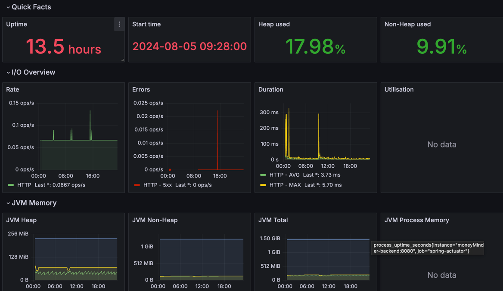
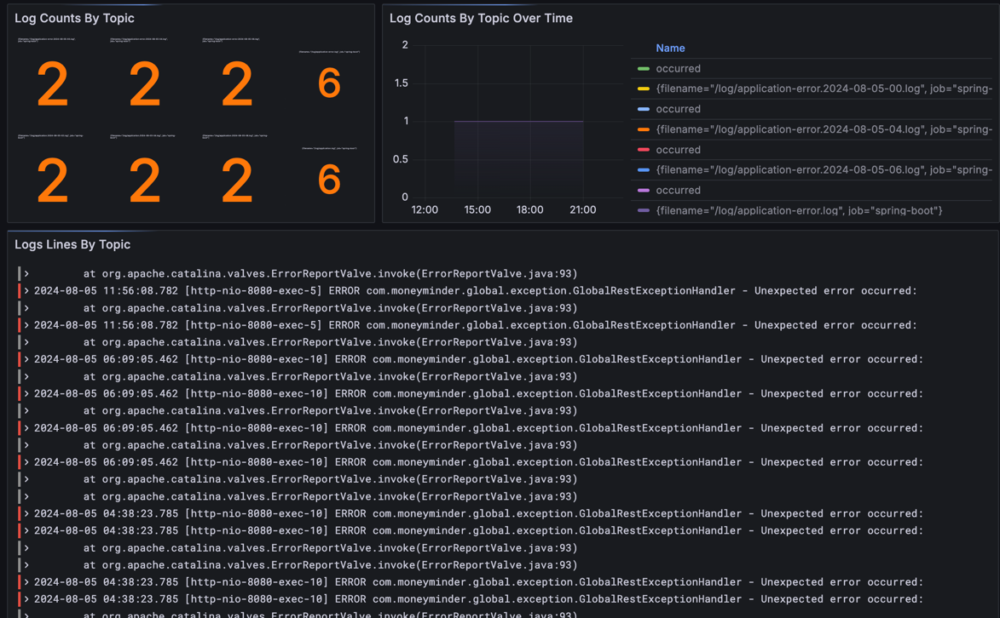
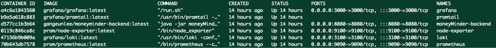

* * *

`모니터링 시스템 구축`을 하는 사람들에게 도움이 되고자 작성합니다.

모든 내용을 친절하게 설명하지는 않습니다..  

상황에 따라 요구사항과 구현 방법이 달라질 수 있으며,  

이 글은 `모니터링 시스템 구축`에 초점을 맞추므로, 부수적인 설명은 간략하게 다루겠습니다.

먼저 완성시 최종 `Grafana` 대시보드를 보여드리겠습니다.

여유가 되신다면 서버 스펙을 올리고 하시는걸 권해드립니다.. 상당히 무거워서 메모리 꽉참..

 



<br><br>

## ✅  아키텍처 구조
[프로젝트 코드 보기](https://github.com/GangEunzzang/MoneyMinder)

  

* AWS EC2 free tier (amazon linux)  
* Docker-Compose
* Docker
* Java 17, Spring Boot 3.x, Gradle
* GithubActions
* Prometheus, Grafana, Loki
* EC2 -> `Docker`, `Docker-Compose` 설치  
* EC2 -> Swap Memory 2GB 설정 (안하면 메모리 부족함.. ㅠ)
* Application -> `Dockerfile`, `docker-compose.yml`, `logback-spring.xml` 작성

<br><br>

## ✅ 모니터링  도구 소개

### 📌 Prometheus
* 오픈소스 모니터링 및 경고 도구로, 시스템 및 서비스를 모니터링하고 경고를 생성하는데 사용된다.
* 다양한 서비스 및 시스템에서 지표를 수집하고 저장하는데 사용된다.
* 메트릭을 수집하고 저장하는데 사용된다.  
  

#### prometheus.yml
```yaml
global:
  scrape_interval: 15s

scrape_configs:
  - job_name: 'node-exporter'
    static_configs:
      - targets: ['node-exporter:9100']

  - job_name: 'spring-actuator'
    metrics_path: '/actuator/prometheus'
    static_configs:
      - targets: ['moneyMinder-backend:8080']
```

`global` : 전역 설정을 정의하는 섹션  
`scrap_interval` : 목표 서버에서 메트릭을 가져오는 간격  
`evaluation_interval` : 프로메테우스에서 규칙 평가 및 알람 생성을 실행하는 간격    
`scrip_configs` : 수집 대상 및 대상별 구성을 정의하는 섹션  
`job_name` : 프로메테우스에서 해당 작업을 식별하는 데 사용되는 이름  
`metrics_path` : 메트릭 엔드포인트의 경로 지정  
`static_configs` : 대상 서버를 정의하는 섹션  
`targets` : 메트릭을 수집할 서버  


<br>

### 📌 Grafana
* 오픈소스 분석 및 시각화 도구로, 다양한 데이터 소스에서 데이터를 가져와 대시보드를 만들 수 있다.
* Prometheus, Loki, Graphite, InfluxDB, Elasticsearch 등 다양한 데이터 소스를 지원한다.
* 프로메테우스도 모니터링을 지원하지만, 퀄리티가 상당히 낮다.
* 매우 상세한 정보들을 자신이 원하는대로 커스텀마이징이 가능하다.

<br>

### 📌 lock
* 오픈소스 로그 수집 및 분석 도구로, 로그를 수집하고 저장하는데 사용된다.
* 프로메테우스와 함께 사용하여 로그와 메트릭을 함께 사용하여 시각화 할 수 있다.
* 로그를 수집하고 저장하는데 사용된다.
* 로그를 저장할 수 있는 HTTP API를 제공한다. (http://localhost:3100/loki/api/v1/push)
* Loki데이터 저장소에서 LogQL을 사용하여 데이터 조회할 수 있다.

<br>

### 📌 Promtail
* Loki에 로그를 전송하는 에이전트로, 로그를 수집하고 Loki에 전송하는데 사용된다.

<br>

### 📌 총정리
* Prometheus : 메트릭 수집 및 저장
* Grafana : 메트릭 시각화
* Loki : 로그 수집 및 저장
* Promtail : 로그 수집 및 Loki 전송

간략한 흐름은 다음과 같다.
```text
1. Prometheus가 JVM의 매트릭을 수집한다. `(http://localhost:8080/actuator/prometheus)` -> application.yml 에서 endPoint 설정 가능 
 * 톰캣 메트릭드 수집 가능 (yml에서 열어줘야함)
 
2. Prometheus가 Node Exporter의 매트릭을 수집한다. `(http://localhost:9100/metrics)` -> 이 글에서 다루진 않지만, EC2 서버의 매트릭도 수집 가능

3. Protail이 LogBack의 로그를 수집하여 Loki에 전송한다. `(http://localhost:3100/loki/api/v1/push)`

4. Loki가 LogQL을 사용하여 로그를 저장하고 쿼리한다.

5. Grafana가 Prometheus와 Loki를 통해 데이터를 시각화한다.
```

위와 같이 명확하게 역할이 분리되어 있다.

<br><br>

## ✅ 모니터링 시스템 구축하기


### 📌 Docker File 정의

#### DockerFile
```dockerfile
FROM openjdk:17

WORKDIR /app/moneyMinder

ARG JAR_PATH=build/libs
ARG RESOURCES_PATH=build/resources/main

COPY ${JAR_PATH}/*.jar /app/moneyMinder/moneyMinder.jar

ARG SPRING_PROFILES_ACTIVE=dev
ENV SPRING_PROFILES_ACTIVE=${SPRING_PROFILES_ACTIVE}

ENTRYPOINT ["java", "-jar", "moneyMinder.jar"]
```

* Spring DockerFile 생성
* DockerFile의 최적화를 진행하지 않았는데, 최적화를 진행하면 이미지 크기 및 빌드 시간을 줄일 수 있다.

<br>

### 📌 Logback 설정

#### logback-spring.xml
```xml
<?xml version="1.0" encoding="UTF-8" ?>
<configuration>
  <conversionRule conversionWord="clr" converterClass="org.springframework.boot.logging.logback.ColorConverter" />

  <property name="LOG_PATH" value="./log" />
  <property name="CONSOLE_LOG_PATTERN" value="%d{yyyy-MM-dd HH:mm:ss.SSS} [%thread] %clr(%5level) %cyan(%logger) - %msg%n" />
  <property name="FILE_LOG_PATTERN" value="%d{yyyy-MM-dd HH:mm:ss.SSS} [%thread] %5level %logger - %msg%n" />

  <appender name="CONSOLE" class="ch.qos.logback.core.ConsoleAppender">
    <encoder>
      <pattern>${CONSOLE_LOG_PATTERN}</pattern>
    </encoder>
  </appender>

  <!-- File Appender for general logs -->
  <appender name="FILE" class="ch.qos.logback.core.rolling.RollingFileAppender">
    <file>${LOG_PATH}/application.log</file>
    <encoder>
      <pattern>${FILE_LOG_PATTERN}</pattern>
    </encoder>
    <rollingPolicy class="ch.qos.logback.core.rolling.TimeBasedRollingPolicy">
      <fileNamePattern>${LOG_PATH}/application.%d{yyyy-MM-dd-HH}.log</fileNamePattern>
      <maxHistory>30</maxHistory>
    </rollingPolicy>
  </appender>

  <!-- File Appender for error logs -->
  <appender name="ERROR_FILE" class="ch.qos.logback.core.rolling.RollingFileAppender">
    <file>${LOG_PATH}/application-error.log</file>
    <encoder>
      <pattern>${FILE_LOG_PATTERN}</pattern>
    </encoder>
    <rollingPolicy class="ch.qos.logback.core.rolling.TimeBasedRollingPolicy">
      <fileNamePattern>${LOG_PATH}/application-error.%d{yyyy-MM-dd-HH}.log</fileNamePattern>
      <maxHistory>30</maxHistory>
    </rollingPolicy>
    <filter class="ch.qos.logback.classic.filter.LevelFilter">
      <level>ERROR</level>
      <onMatch>ACCEPT</onMatch>
      <onMismatch>DENY</onMismatch>
    </filter>
  </appender>

  <springProfile name="local">
    <logger name="com.feelcoding.logbackdemo" level="DEBUG" />
    <root level="INFO">
      <appender-ref ref="CONSOLE" />
      <appender-ref ref="FILE" />
      <appender-ref ref="ERROR_FILE" />
    </root>
  </springProfile>

  <springProfile name="dev|stg">
    <root level="INFO">
      <appender-ref ref="CONSOLE" />
      <appender-ref ref="FILE" />
      <appender-ref ref="ERROR_FILE" />
    </root>
  </springProfile>

  <springProfile name="prod">
    <root level="ERROR">
      <appender-ref ref="CONSOLE" />
      <appender-ref ref="FILE" />
      <appender-ref ref="ERROR_FILE" />
    </root>
  </springProfile>
</configuration>
```

* 현재 설정은 local, dev, stg, prod 로그 차이가 없음 원하는대로 커스텀 가능
* `application.log`, `application-error.log` 파일로 로그가 생성됨
* 로그 폴더 생성 위치는 `./log` 로 설정

<br>


### 📌 Docker Compose 정의

#### docker-compose.yml
```yaml
version: '3.8'
networks:
  moneyMinder-network:
    driver: bridge

services:
  prometheus:
    image: prom/prometheus:latest
    container_name: prometheus
    volumes:
      - ./monitoring/prometheus.yml:/etc/prometheus/prometheus.yml
      - prometheus-data:/prometheus
    command:
      - '--config.file=/etc/prometheus/prometheus.yml'
    ports:
      - "9090:9090"
    networks:
      - moneyMinder-network

  grafana:
    image: grafana/grafana:latest
    container_name: grafana
    ports:
      - "3000:3000"
    volumes:
      - grafana-data:/var/lib/grafana
    networks:
      - moneyMinder-network

  moneyMinder-backend:
    image: gangeunlee/moneyminder-backend:latest
    container_name: moneyMinder-backend
    restart: always
    ports:
      - "8080:8080"
    volumes:
      - /home/ec2-user/backend/log:/app/moneyMinder/log
    networks:
      - moneyMinder-network
    environment:
      SPRING_PROFILES_ACTIVE: dev
    env_file:
      - .env

  node-exporter:
    image: prom/node-exporter:latest
    container_name: node-exporter
    ports:
      - "9100:9100"
    networks:
      - moneyMinder-network
    restart: always

  loki:
    image: grafana/loki:latest
    container_name: loki
    ports:
      - "3100:3100"
    networks:
      - moneyMinder-network
    command: -config.file=/etc/loki/local-config.yaml
    volumes:
      - loki-data:/loki

  promtail:
    image: grafana/promtail:latest
    container_name: promtail
    networks:
      - moneyMinder-network
    volumes:
      - /home/ec2-user/backend/log:/log
      - ./monitoring/promtail.yml:/etc/promtail/promtail.yml
    command: -config.file=/etc/promtail/promtail.yml


volumes:
  grafana-data:
  prometheus-data:
  loki-data:
```

* `prometheus`, `grafana`, `loki`, `promtail` 모니터링을 위한 컨테이너 정의
* `moneyMinder-backend` 서비스는 `gangeunlee/moneyminder-backend:latest` 이미지로 실행
* 그라파나, 프로메테우스, 로키는 각각 volume 따로 마운트 설정

<br>

### 📌 GitHub Actions 설정

#### deploy.yml
```yaml
name: CI/CD Pipeline

on:
  push:
    branches:
      - master
  workflow_dispatch:

jobs:
  build:
    runs-on: ubuntu-latest

    steps:
      # 코드 체크아웃
      - name: Checkout code
        uses: actions/checkout@v2

      # JDK 설치
      - name: Set up JDK 17
        uses: actions/setup-java@v2
        with:
          distribution: 'adopt'
          java-version: '17'

      # Gradle 빌드
      - name: Build with Gradle
        working-directory: backend
        run: ./gradlew build

      # Docker Hub 로그인
      - name: Log in to Docker Hub
        uses: docker/login-action@v2
        with:
          username: ${{ secrets.DOCKER_HUB_USERNAME }}
          password: ${{ secrets.DOCKER_HUB_ACCESS_TOKEN }}

      # Docker 이미지 빌드 및 푸쉬
      - name: Build and Push Docker image
        working-directory: backend
        run: |
          docker build --platform linux/amd64 -t gangeunlee/moneyminder-backend:latest .
          docker push gangeunlee/moneyminder-backend:latest 

  deploy:
    runs-on: ubuntu-latest
    needs: build

    steps:
      # 코드 체크아웃
      - name: Checkout code
        uses: actions/checkout@v2

      # Docker Compose 및 모니터링 설정 파일 서버로 전송
      - name: Send configuration files
        uses: appleboy/scp-action@master
        with:
          username: ${{ secrets.EC2_USER }}
          host: ${{ secrets.EC2_HOST }}
          key: ${{ secrets.EC2_SSH_KEY }}
          source: backend/docker-compose.yml, backend/monitoring
          target: /home/${{ secrets.EC2_USER }}

      # EC2 서버에 SSH 접속하여 Docker Compose 실행
      - name: SSH to EC2 and deploy
        uses: appleboy/ssh-action@master
        with:
          host: ${{ secrets.EC2_HOST }}
          username: ${{ secrets.EC2_USER }}
          key: ${{ secrets.EC2_SSH_KEY }}
          port: 22
          script: |
            cd /home/${{ secrets.EC2_USER }}/backend
            
            # 환경 변수 설정 파일 생성
            echo "SPRING_PROFILES_ACTIVE=${{ secrets.SPRING_PROFILES_ACTIVE }}" > .env
            echo "SPRING_DATASOURCE_URL=${{ secrets.SPRING_DATASOURCE_URL }}" >> .env
            echo "SPRING_DATASOURCE_USERNAME=${{ secrets.SPRING_DATASOURCE_USERNAME }}" >> .env
            echo "SPRING_DATASOURCE_PASSWORD=${{ secrets.SPRING_DATASOURCE_PASSWORD }}" >> .env
            echo "GOOGLE_OAUTH2_CLIENT_ID=${{ secrets.GOOGLE_OAUTH2_CLIENT_ID }}" >> .env
            echo "GOOGLE_OAUTH2_CLIENT_SECRET=${{ secrets.GOOGLE_OAUTH2_CLIENT_SECRET }}" >> .env
            echo "AUTH_TOKEN_SECRET_KEY=${{ secrets.AUTH_TOKEN_SECRET_KEY }}" >> .env
            
            # Docker Compose를 사용하여 서비스 배포
            sudo docker-compose down
            sudo docker-compose pull
            sudo docker-compose up -d
```

* `GitHub Actions`를 사용하여 CI/CD 파이프라인 구축

<br>

### 📌 Docker-Compose 실행 확인

#### Docker ps 명령어


* 정상적으로 실행이 됐으면 `node-exporter` 컨테이너를 제외하고 모두 실행이 됐을것이다.
* `/home/ec2-user/backend/log` 경로에 로그 파일이 제대로 생성되고 있나 확인해봐야한다.

<br>

### 📌 Grafana  대시보드 생성

도커로 띄운 그라파나에 접속한다.   
`${host_ip}:3000` 별도의 설정을 안했으니 기본 ID,PW 는 `admin, admin` 이다.

<br>

#### Connection DataSource 생성
* Home -> Connection -> Data Sources -> Add new Data Source    

> Prometheus 선택 후 URL 입력 `http://prometheus:9090`  Save & Test 클릭

> Loki 선택 후 URL 입력 `http://loki:3100`  Save & Test 클릭

<br> 

#### Dashboards 생성
* Home -> Dashboards -> New > import   

>  4701 입력 후 `Load` 클릭 -> `Prometheus` 선택 후 `Import` 클릭

>  17139 입력 후 `Load` 클릭 -> `Loki` 선택 후 `Import` 클릭


<br><br>
각자 환경에 알맞게 수정이 필요합니다.  
그리고 위 내용에서 다루진 않았지만, `alertmanager` 를 사용하여 알람 설정도 가능합니다.  
각 모니터링 시스템 별 yml 파일을 수정하여 설정이 가능합니다.  [위 프로젝트 모니터링 설정 파일 보러가기](https://github.com/GangEunzzang/MoneyMinder/tree/master/backend/monitoring)

<br><br>

## ✅ 마치며
* 인프라 레벨에서는 무중단 배포 + 모니터링은 필수로 알아두어야 한다.
* 사실 Docker-Compose를 처음 사용해봤는데 매우 편리한 것 같다..!
* 모니터링 시스템을 구축하면서 `Prometheus`, `Grafana`, `Loki` 에 대해 많이 알게 되었다.

