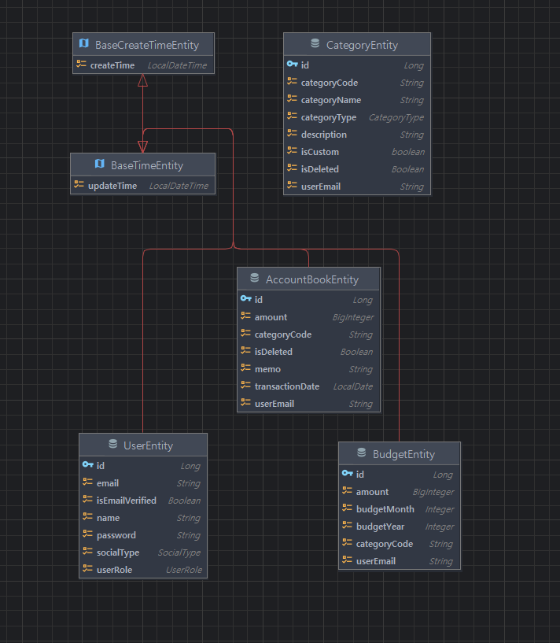

* * *

MSA를 개인적으로 공부하며, 제 개인 프로젝트인 가계부 웹을 MSA로 전환해보기로 했습니다.

현재 가계부 웹은 모놀리식으로 구성되어 있습니다.

아래는 제 가계부 웹의 ERD 입니다.

* * *

## ✅ Monolithic Architecture
모놀리식 아키텍처는 모든 기능과 서비스를 하나의 단일 애플리케이션으로 통합하여 개발하는 아키텍처 패턴입니다.   
일반적으로 단일 코드베이스에서 작동하며, 데이터베이스, 비즈니스 로직, 사용자 인터페이스 등 모든 구성 요소가 통합되어 있습니다.

### 📌 장점

#### 1. 개발 및 배포가 간단하다
* 모든 서비스가 하나의 애플리케이션에 포함되어 있기 때문에 개발 및 배포가 간단합니다.
* 초기 개발 단계에서는 빠르게 개발하고 배포할 수 있습니다.

#### 2. 테스트가 용이하다
* 통합된 구조로 인해 테스트 환경이 단순하며 테스트 케이스 작성이 간단합니다.
* 통합 테스트와 단위 테스트가 비교적 간편하게 이루어질 수 있습니다.

#### 3. 아키텍처 구조 및 설계가 간단하다
* 아키텍처에 대한 이해가 쉽고, 설계를 비교적 간단하게 할 수 있습니다.

#### 4. 성능이 좋을 수 있다.
* 하나의 프로세스로 동작하기 때문에 서비스 간의 네트워크 통신 비용이 없습니다.

### 📌 단점

#### 1. 유지보수가 어렵다.
* 애플리케이션이 커질수록 코드의 복잡도가 증가하고, 유지보수가 어려워집니다.
* 하나의 작은 변경이 전체 시스템에 영향을 미칠 수 있습니다.

#### 2. 확장성이 떨어진다.
* 특정 도메인(모듈)만 확장하기 어렵기 때문에 항상 전체 어플리케이션 단위로 움직여야 합니다.

#### 3. 배포 시간이 길다.
* 전체 어플리케이션을 빌드하고 배포해야 하기 때문에 배포 시간이 길어질 수 있습니다.

#### 4. 장애 전파 문제
* 하나의 도메인(모듈)에서 발생한 오류가 전체 어플리케이션에 영향을 미칠 수 있씁니다.

   

## ✅ Micro Services Architecture
MSA 서비스를 작은 단위로 나눠서 개발하는 아키텍처 패턴입니다.  
도메인(서비스)별로 독립적인 애플리케이션 환경을 구축하여 개발/배포 하는 아키텍처입니다.

### 📌 장점

#### 1. 서비스별로 확장이 용이하다.
* 개별 도메인별로 서비스를 분리하기 때문에 필요한 서비스만 확장이 가능합니다.

#### 2. 유연한 기술 스택 선택이 가능하다.
* 서비스별로 다른 기술 스택을 선택할 수 있습니다.

#### 3. 유지보수가 용이하다.
* 도메인 별로 분리해놓기 때문에 모놀리틱 구조보다 상대적으로 유지보수가 편리하다.

### 📌 단점

#### 1. 복잡한 아키텍처 관리
* 서비스 간의 `통신`,` 서비스 디스커버리`, `데이터 동기화`, `서킷 브레이커` 등 복잡한 아키텍처 관리가 필요해집니다.

#### 2. 테스트가 어렵다.
* 여러 서비스가 유기적으로 연결되어 있어 통합 테스트가 복잡해집니다.

#### 3. 초기 구축 비용 증가
* 모놀리틱 구조보다 초기 구축 비용이 높을 수 있습니다.
* 초기 설계, 아키텍처 구성, 인프라 구성을 위한 비용이 증가할 수 있습니다.

   

## ✅ MSA의 구성요소 분석
아래의 이미지를 보자

MSA는 크게 6가지의 필수 구성요소로 구성되어 있습니다.

### 📌1. External Gateway
* 외부에서 서비스에 접근할 수 있는 게이트웨이 역할을 합니다.
* 클라이언트의 요청을 받아서 서비스로 라우팅하고, 서비스의 응답을 클라이언트에게 전달합니다.
* ex) Spring Cloud Gateway, Netflix Zuul 등

### 📌2. Service Mesh
* 서비스 간의 통신을 관리하는 인프라스트럭처입니다.
* 서비스 간의 감지(Discovery), 라우팅, 분산처리, 인증/인가, 보안 등을 담당합니다.
* ex) Istio, Linkerd, Consul 등

### 📌3. Runtime Platform
* 실제 비즈니스 로직이 수행되는 영역입니다.
* 실질적인 기능들이 있는 서버와 이 서버들을 사용량에 따라 Auto scaling 하는 기능도 이 영역에 포합된다.
* ex) AWS EKS, GCP GKE, Azure AKS 등

### 📌4. Backend Service
* Backing Service는 일종의 데이터베이스나 메시징 시스템 등의 서비스를 말합니다.
* 서비스의 데이터를 저장하거나, 메시지를 전달하는 역할을 합니다.
* ex) MySQL, Redis, RabbitMQ, Kafka 등

### 📌5. Telemetry
* 서비스의 상태를 모니터링하고, 로깅하는 역할을 합니다.
* MSA는 복잡한 구조로 이루어져 있기 때문에, 시스템 진단 기능과 모니터링 기능이 필수적이다.
* ex) Prometheus, Grafana, ELK Stack 등

### 📌6. CI/CD
* 지속적인 통합 및 배포를 위한 환경을 제공합니다.
* MSA에는 CI/CD를 적용하지 않는다면, 구조가 복잡해지기 때문에 모놀리틱 구조보다 보다 더욱 신경써서 관리해야 합니다.
* ex) Jenkins, GitLab CI, Circle CI 등

### 📌각 영역별 대표적인 기술들

   

## ✅ MSA 분리시 고려사항
MSA로 전환하기 위해서는 아래와 같은 고려사항이 필요합니다.

### 📌1. 도메인 분리
* 도메인을 어떻게 분리할 것인지에 대한 고민이 필요합니다.
* 도메인을 어떻게 나눌 것인지, 각 도메인별로 어떤 서비스를 구성할 것인지 등을 고려해야 합니다.

### 📌2. 서비스 간의 통신
* 서비스 간의 통신은 어떻게 할 것인지에 대한 고민이 필요합니다.
* REST API, gRPC, Kafka 등을 사용하여 통신할 수 있습니다.

### 📌3. 데이터 관리
* 데이터를 어떻게 관리할 것인지에 대한 고민이 필요합니다.
* 데이터의 일관성, 데이터의 동기화 등을 고려해야 합니다.
* ex) Event Sourcing, CQRS 패턴 등

### 📌4. 서비스 디스커버리
* 서비스 디스커버리는 어떻게 할 것인지에 대한 고민이 필요합니다.
* 서비스의 동적인 확장, 서비스의 위치 등을 고려해야 합니다.
* ex) Eureka, Consul, Zookeeper 등

  

## ✅ 마치며
이번 포스팅에서는 이론적인 개념에 대해 깊게 공부해봤습니다.  
이후에는 현재 프로젝트에서 MSA로 전환하는 과정을 정리해보겠습니다.

