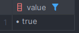

* * *

분산락을 구현하기 위해 Redis의 SETNX는 자주 사용된다.
어떤 상황에서 적용하면 좋은지, 어떤식으로 사용하는지 정리해보겠다.

<br><br>

## ✅ SETNX란?

`SETNX`는 Redis의 명령어 중 하나로, `SET Not Exists`의 약자이며, 키가 존재하지 않을 때만 값을 설정하는 명령어이다.  
즉, 키가 존재하지 않을 때만 값을 설정하고, 키가 존재할 경우 아무런 작업도 수행하지 않는다.  

아래와 같은 커맨드로 SETNX를 사용할 수 있다.  
`SETNX {key} {value}`

### 📌 예제
```redis
SETNX key1 value1
```




위와같이 key1로 lock 생성을 했으면 true를 반환해주고,  
이미 key1이 존재하면 false를 반환해준다.

즉, SETNX는 위와 같은 개념을 바탕으로 분산락을 구현할 때 사용된다.

## ✅ 분산락 구현

`Spring Data Redis` 를 사용하여 분산락을 구현해보겠다.
