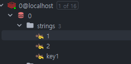

* * *

분산락을 구현하기 위해 Redis의 SETNX는 자주 사용된다.
어떤 상황에서 적용하면 좋은지, 어떤식으로 사용하는지 정리해보겠다.

<br><br>

## ✅ SETNX란?

`SETNX`는 Redis의 명령어 중 하나로, `SET Not Exists`의 약자이며, 키가 존재하지 않을 때만 값을 설정하는 명령어이다.  
즉, 키가 존재하지 않을 때만 값을 설정하고, 키가 존재할 경우 아무런 작업도 수행하지 않는다.  

아래와 같은 커맨드로 SETNX를 사용할 수 있다.  
`SETNX {key} {value}`

### 📌 예제
```redis
SETNX key1 value1
```




위와같이 key1로 lock 생성을 했으면 true를 반환해주고,  
이미 key1이 존재하면 false를 반환해준다.

즉, SETNX는 위와 같은 개념을 바탕으로 분산락을 구현할 때 사용된다.

## ✅ 분산락 구현

Redis 클라이언트 라이브러리인 `Lettuce`를 기반으로 `Spring Data Redis` 를 사용하여 분산락을 구현해보자

<br>

### 📌 Redis 분산락의 주요 로직
`락 획득 (Acquire Lock)`  
SETNX를 통해 키가 없을 경우 락을 생성
락에 만료 시간을 설정하여 무한 대기 방지

`비즈니스 로직 실행`  
락이 성공적으로 획득된 경우, 해당 작업을 실행

`락 해제 (Release Lock)`  
작업이 끝나면 락을 해제한다.
다른 클라이언트가 락을 사용 가능하도록 만든다.

<br>

### 📌 RedisLockService 구현
아래는 Redis의 SETNX 명령어를 사용하여 분산락을 구현한 예제입니다.

```java
@RequiredArgsConstructor
@Service
public class RedisLockService {

    private final StringRedisTemplate redisTemplate;

    /**
     * 락 획득
     * @param key 락의 키
     * @param value 락의 값 (보통 고유한 UUID 사용)
     * @param timeout 락의 만료 시간 (초 단위)
     * @return 락 획득 성공 여부
     */
    public boolean acquireLock(String key, String value, long timeout) {
        Boolean result = redisTemplate.opsForValue()
                .setIfAbsent(key, value, timeout, TimeUnit.SECONDS);
        return Boolean.TRUE.equals(result);
    }

    /**
     * 락 해제
     * @param key 락의 키
     * @param value 락의 값 (락을 소유한 클라이언트만 해제할 수 있도록)
     */
    public void releaseLock(String key, String value) {
        String currentValue = redisTemplate.opsForValue().get(key);
        if (value.equals(currentValue)) {
            redisTemplate.delete(key);
        }
    }
}

```

<br>

### 📌 서비스에 락 적용하기
위에서 구현한 RedisLockService를 활용하여, 특정 작업(예: 티켓 구매)에 락을 적용합니다.

```java
@RequiredArgsConstructor
@Service
public class TicketService {

    private final TicketRepository ticketRepository;
    private final RedisLockService redisLockService;

    public void purchaseTicket(Long ticketId, int quantity) {
        String lockKey = "ticket:" + ticketId;
        String lockValue = UUID.randomUUID().toString();

        // 락 획득
        boolean lockAcquired = redisLockService.acquireLock(lockKey, lockValue, 10);
        if (!lockAcquired) {
            throw new RuntimeException("Could not acquire lock for ticket purchase");
        }

        try {
            // 티켓 구매 로직
            Ticket ticket = ticketRepository.findById(ticketId)
                    .orElseThrow(() -> new RuntimeException("Ticket not found"));

            if (ticket.getQuantity() < quantity) {
                throw new RuntimeException("Not enough tickets available");
            }

            ticket.decreaseQuantity(quantity);
            ticketRepository.save(ticket);

        } finally {
            // 락 해제
            redisLockService.releaseLock(lockKey, lockValue);
        }
    }
}
```

<br>

### 📌 어떤 상황에서 위 코드를 적용하면 좋을까?

위 코드는 `락 획득 실패 시 즉시 종료`하는 방식으로 설계되었다. 이러한 방식은 다음과 같은 상황에서 유용하다.

`1.중요도가 낮은 작업`
* 작업이 반드시 수행될 필요는 없고, 실패해도 큰 문제가 없는 경우
* 예를 들어 티켓 구매 시도가 실패해도 사용자가 다시 요청을 시도하거나, 다른 티켓을 선택 할 수 있는 상황

`2.다른 대안이 있는 경우`
* 특정 자원(티켓, 상품 등)에 대한 작업이 실패해도, 다른 자원으로 대체할 수 있는 경우
* 예를 들어 특정 좌석의 티켓 예매에 실패했을 때, 사용자가 다른 좌석을 선택할 수 있는 구조

`3.실시간 응답 속도가 중요한 경우`
* 빠른 응답이 중요한 시스템에서 락 획득 실패 시 재시도를 하지않고 바로 종료함으로써 전체적인 부하 감소

`4. 락 경쟁이 드문 경우`
* 락 경쟁이 드문 경우에는 락 획득 실패가 발생할 확률이 낮아, 락 획득 실패 시 즉시 종료해도 큰 문제가 없는 경우

### 📌 재시도가 필요한 경우

`1. 작업 성공이 중요한 경우`
* 특정 작업이 반드시 수행되어야 하며, 락을 얻기 위해 재시도할 가치가 있는 경우
* 예를 들어 VIP 고객의 티켓 예매 요청은 실패할 수 없고, 몇 초 동안이라도 락을 재시도하여 반드시 완료해준다. (비즈니스 관점으로 적절한 예는 아니지만 알잘딱깔센..)

`2. 락 경쟁이 치열한 경우`
* 락 경쟁이 치열한 경우에는 락 획득 실패 시 재시도를 통해 락을 얻을 확률을 높일 수 있음
* 예를 들어 특정 상품의 재고를 감소시키는 작업이 많은 클라이언트에서 동시에 발생하는 경우

`3. 비즈니스 이벤트의 중요성`
* 특정 이벤트가 실패하면 비즈니스적으로 큰 손실을 초래하는 경우
* 예를 들어 한정된 수량의 상품을 판매하는 이벤트에서, 락 획득 실패 시 재시도를 통해 이벤트를 성공적으로 완료

### 📌 재시도 로직 추가

```java
public void purchaseTicketWithRetry(Long ticketId, int quantity, int maxRetries, long retryDelayMillis) {
    String lockKey = "ticket:" + ticketId;
    String lockValue = UUID.randomUUID().toString();
    int attempts = 0;

    while (attempts < maxRetries) {
        attempts++;
        boolean lockAcquired = redisLockService.acquireLock(lockKey, lockValue, 10);
        if (lockAcquired) {
            try {
                processPurchase(ticketId, quantity);
                return; // 성공 시 종료
            } finally {
                redisLockService.releaseLock(lockKey, lockValue);
            }
        }

        // 재시도 전 대기
        try {
            Thread.sleep(retryDelayMillis);
        } catch (InterruptedException e) {
            Thread.currentThread().interrupt();
            throw new RuntimeException("Thread interrupted during retry delay", e);
        }
    }

    // 재시도 실패 시 예외 발생
    throw new RuntimeException("Could not acquire lock for ticket purchase after " + maxRetries + " retries");
}
```
위와 같이 적절한 재시도 횟수, 딜레이 시간을 설정하여 락 획득에 실패한 경우 재시도할 수 있다.

<br>

### 📌 즉시 실패 vs 재시도

|구분 | 즉시 실패 | 재시도
|---|---|---|
|특징 | 실패 시 빠르게 종료 | 제한된 횟수만큼 재시도
|적용 사례 | 응답 속도가 중요한 경우 | 작업 성공률이 중요한 경우
|장점 | 처리 속도가 빠르고 시스템 부담이 적음 | 성공률 증가, 중요한 작업의 안정성 보장
|단점 | 실패율이 높아질 가능성 | 재시도로 인해 지연 발생

<br>

### 📌 분산락 동작 원리

`1.락 생성`  
acquireLock 메서드는 SETNX 명령어를 호출하여 특정 키(lockKey)에 대한 락을 생성합니다.
동시에 다른 클라이언트가 동일한 키로 락을 생성하려고 하면, false를 반환하여 실패합니다.

`2.만료 시간 설정`  
락 생성 시 timeout(10초)과 함께 설정됩니다.
설정된 시간 내에 락이 해제되지 않으면, 자동으로 락이 만료됩니다.

`3.작업 수행`  
락을 성공적으로 획득한 클라이언트만 티켓 구매 작업을 진행합니다.

`4.락 해제`  
작업이 끝난 후, 락의 값(lockValue)을 확인하여 현재 클라이언트가 락 소유자인 경우에만 해제합니다.
다른 클라이언트가 락을 잘못 해제하지 못하도록 방지합니다.

<br><br>

## ✅ 분산락 주의사항
`1. 락 만료 시간 관리`
   * 작업 시간이 설정된 락의 만료 시간을 초과할 경우, 다른 클라이언트가 락을 획득할 수 있어 데이터 불일치가 발생할 수 있다.
   * 이를 방지하려면 작업 진행 중 주기적으로 락의 TTL을 갱신하는 방식(예: Watchdog)을 고려할 수 있다.
`2. 락 해제 검증`
   * releaseLock에서 현재 클라이언트가 락의 소유자인지 확인하는 로직이 필요합니다. Redis 트랜잭션을 사용하여 원자성을 보장하는 것이 좋다.
`3. Redis 분산락 대안`
   * 보다 안전한 분산락 구현을 위해 Redisson이나 ZooKeeper와 같은 라이브러리를 사용할 수 있다.
   * 특히 Redisson은 Redis의 Lua 스크립트를 사용하여 락의 원자성과 만료 시간 관리를 개선한 구현체를 제공한다.

<br><br>

## ✅ 마치며
 *  하지만 락 만료 시간 관리나 복잡한 시나리오에 대해서는 추가적인 구현이 필요하다.
 * 비즈니스 요구사항에 맞는 분산락 구현 방식을 선택하는 것이 중요하다.
 * SETNX는 순서 보장이 되지 않으므로, 순서가 중요한 작업에는 적합하지 않다.
