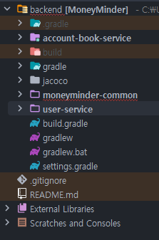

* * *

기존 제 프로젝트는 단일모듈로 구성되어 있었고 이를 멀티모듈로 구성하여 MSA로 전환해보겠습니다.

## ✅ 멀티 모듈 이란?
* 멀티 모듈은 여러 개의 모듈을 하나의 프로젝트로 관리하는 방법입니다.
* 여러 개의 모듈을 하나의 프로젝트로 관리하면, 각 모듈을 독립적으로 관리할 수 있습니다.

즉, MSA 구조에서는 각 마이크로서비스를 하나의 모듈로 관리하게 됩니다.       
이를 위해 기존의 단일 모듈 구조에서 멀티 모듈 구조로 변경해보겠습니다.

<br> 

### 📌 멀티모듈 단일 프로젝트
모든 모듈을 하나의 프로젝트로 관리하는 방법입니다.  
예를 들어, Gradle 또는 Maven을 기준으로 `루트 프로젝트`가 존재하고 그 하위에 여러 `서브 모듈`이 존재하는 구조입니다

#### 🛠 구조 예시

```scss
root
├── build.gradle       
├── settings.gradle
├── module-a (project starter module)
│   ├── build.gradle
│   └── src
|── └── StartApplication.java
├── module-b
│   ├── build.gradle 
│   └── src
└── module-c
│   ├── build.gradle
│   └── src
```

위와 같은 구조는 결국 하나의 프로젝트로 관리되는 것이기 때문에, 모든 모듈이 하나의 빌드 프로세스를 가지게 됩니다.    
즉 점진적으로 MSA로 전환시 임시 구조로는 적합하지만, 각 마이크로서비스를 독립적으로 관리하기에는 한계가 있습니다.

<br> 

### 📌 멀티모듈 멀티 프로젝트
* 여러 개의 프로젝트로 나누어 각 프로젝트를 독립적으로 관리하는 방법입니다.  
* 각 프로젝트는 독립적으로 빌드하고 배포할 수 있습니다.  


#### 🛠 구조 예시

```scss
root
├── build.gradle
├── settings.gradle
├── module-a
│   ├── build.gradle
│   └── src
│       └── StartApplication.java
├── module-b
│   ├── build.gradle
│   └── src
│       └── StartApplication.java
├── module-c
│   ├── build.gradle
│   └── src
│       └── StartApplication.java

```

각 모듈이 독립적인 프로젝트 단위로 분리가 되어 있어, 각각 별도의 빌드/배포 프로세스를 가질 수 있습니다.  
이를 통해 각 마이크로서비스를 독립적으로 관리할 수 있게 됩니다.  

<br> 
<br> 


## ✅ 멀티 모듈 구성하기

최종적으로 구성할 멀티 모듈은 아래와 같습니다.

```scss
root
├── build.gradle
├── settings.gradle
├── account-book-service
│   ├── build.gradle
│   └── src
│       └── StartApplication.java
├── user-service
│   ├── build.gradle
│   └── src
│       └── StartApplication.java
├── common
│   ├── build.gradle
│   └── src
│       └── StartApplication.java
```

* `account-book-service` : 가계부 관련 서비스
* `user-service` : 사용자 관련 정보 서비스
* `common` : 공통 모듈

1차적으로는 위와 같이 3개의 모듈로 나누고  
최종적으로는
`api-gateway`, `discovery-server`, `config-server` 등의 모듈을 추가할 예정입니다.

<br> 


### 📌 현재 프로젝트 구조


현재 프로젝트 구조는 위와 같이 단일 모듈로 구성되어 있습니다.
`domain`, `global` 패키지를 포함하고 있습니다. 

<br>

### 📌 최종 프로젝트 구조


1. `account-book-service`
* accountbook 패키지
* budget 패키지
* category 패키지

2. `user-service`
* user 패키지

3. `moneyminder-common`
* global 패키지
* domain.auth 패키지

향후 `api-gateway`, `discovery-server`, `config-server` 등의 모듈을 추가할 예정이므로 auth 패키지는 api-gateway로 이동할 예정입니다.


### 📌 Root 모듈 구성

이제 Root 모듈에서는 `각 모듈을 관리하는 역할`만 수행하게 됩니다.  
이를 위해 `settings.gradle`과 `build.gradle`을 설정해 보겠습니다.

<br>

#### 🛠 settings.gradle
```groovy
rootProject.name = 'MoneyMinder'

// build.gradle이 있는 디렉토리만 포함
file(rootDir).eachDir { dir ->
  if (new File(dir, 'build.gradle.kts').exists() || new File(dir, 'build.gradle').exists()) {
    include dir.name
  }
}

```

* `rootProject.name`: Root 프로젝트의 이름
* `file(rootDir).eachDir`: 루트 디렉토리 내 모든 서브폴더를 자동으로 모듈로 등록
  * `new File(dir, 'build.gradle').exists()`: 서브폴더 내에 `build.gradle` 파일이 존재하는 경우 해당 모듈로 등록

<br>

#### 🛠 build.gradle (Root)
```groovy
plugins {
    id 'java'
    id 'org.springframework.boot' version '3.3.0'
    id 'io.spring.dependency-management' version '1.1.5'
}

group = 'com.moneyminder'
version = '0.0.1'

repositories {
    mavenCentral()
}


// 모든 서브프로젝트 공통 설정
subprojects {

    apply plugin: 'java'
    apply plugin: 'org.springframework.boot'
    apply plugin: 'io.spring.dependency-management'

    group = rootProject.group
    version = rootProject.version
    sourceCompatibility = '17'

    repositories {
        mavenCentral()
    }

    dependencyManagement {
        imports {
            mavenBom "org.springframework.boot:spring-boot-dependencies:3.3.0"
        }
    }
}

bootJar {
    enabled = false
}
jar {
    enabled = true
}

project(':user-service') {
    dependencies {
        implementation project(':moneyminder-common')
    }
}

project(':account-book-service') {
    dependencies {
        implementation project(':moneyminder-common')
    }
}
```

* `BootJar` & `Jar` 설정
  * `BootJar`: Spring Boot 애플리케이션을 실행 가능한 JAR 파일로 만들어주는 플러그인
  * `Jar`: JAR 파일을 만들어주는 플러그인
  * `enabled`: JAR 파일 생성 여부  
   즉, `Jar`만 활성화시키면 실행되는 jar파일이 아닌, 라이브러리 역할의 jar파일을 추출할 수 있다.


* `subprojects`
  * 모든 서브프로젝트에 공통으로 적용할 설정
  * `sourceCompatibility`: Java 버전 설정
  * `repositories`: Maven Central Repository 추가
  * `dependencyManagement`: 의존성 관리 설정


* `project(':user-service')`, `project(':account-book-service')`
  * `user-service`, `account-book-service` 모듈에서 `moneyminder-common` 모듈을 참조할 수 있도록 설정

<br>

#### 🛠 build.gradle (user-service, account-book-service)
```groovy
plugins {
    id 'java'
    id 'org.springframework.boot'
    id 'application'
}

dependencies {
    implementation 'org.springframework.boot:spring-boot-starter-web'
    implementation 'org.springframework.boot:spring-boot-starter-data-jpa'
    runtimeOnly 'com.h2database:h2'
}

application {
    mainClass = 'com.moneyminder.UserApplication'
}

bootJar {
    mainClass = 'com.moneyminder.UserApplication'
}

```

각 모듈에서 사용하는 의존성 및 설정을 별도로 작성합니다.

* `application`
  * `mainClass`: 실행할 메인 클래스 지정

<br>

#### 🛠 build.gradle (moneyminder-common)
```groovy
configurations {
    compileOnly {
        extendsFrom annotationProcessor
    }
}

dependencies {
    compileOnly 'org.projectlombok:lombok'
    annotationProcessor 'org.projectlombok:lombok'

    implementation 'org.springframework.boot:spring-boot-starter'
    implementation 'org.springframework.boot:spring-boot-starter-data-jpa'
    implementation 'org.springframework.boot:spring-boot-starter-security'
    implementation 'org.springframework.boot:spring-boot-starter-web'

    // oauth2
    implementation 'org.springframework.boot:spring-boot-starter-oauth2-client'

    //jwt
    implementation 'io.jsonwebtoken:jjwt-api:0.11.2'
    runtimeOnly 'io.jsonwebtoken:jjwt-impl:0.11.2'
    runtimeOnly 'io.jsonwebtoken:jjwt-jackson:0.11.2'

    //로그 출력 p6spy
    implementation 'p6spy:p6spy:3.9.1'
    implementation 'com.github.gavlyukovskiy:datasource-decorator-spring-boot-autoconfigure:1.9.0'

    // lombok
    annotationProcessor 'org.projectlombok:lombok'
    compileOnly 'org.projectlombok:lombok'

    // validation
    implementation 'org.springframework.boot:spring-boot-starter-validation'

    // QueryDSL
    implementation 'com.querydsl:querydsl-jpa:5.0.0:jakarta'
    annotationProcessor "com.querydsl:querydsl-apt:5.0.0:jakarta"
    annotationProcessor "jakarta.annotation:jakarta.annotation-api"
    annotationProcessor "jakarta.persistence:jakarta.persistence-api"

    // guava
    implementation 'com.google.guava:guava:32.1.2-jre'

    // actuator && prometheus
    implementation 'org.springframework.boot:spring-boot-starter-actuator'
    runtimeOnly "io.micrometer:micrometer-registry-prometheus"

    // commons-lang3
    implementation group: 'org.apache.commons', name: 'commons-lang3', version: '3.12.0'
    // 메일 전송 라이브러리
    implementation 'org.springframework.boot:spring-boot-starter-mail'

    // redis
    implementation 'org.springframework.boot:spring-boot-starter-data-redis'

    // embedded-redis
    compileOnly group: 'it.ozimov', name: 'embedded-redis', version: '0.7.2'
    testImplementation group: 'it.ozimov', name: 'embedded-redis', version: '0.7.2'

    // slack
    implementation "net.gpedro.integrations.slack:slack-webhook:1.4.0"


    developmentOnly 'org.springframework.boot:spring-boot-devtools'

    runtimeOnly 'com.h2database:h2'
    runtimeOnly 'com.mysql:mysql-connector-j'

    testImplementation 'org.springframework.boot:spring-boot-starter-test'
    testImplementation 'org.springframework.security:spring-security-test'
    testImplementation 'io.rest-assured:rest-assured:5.3.0'

    testRuntimeOnly 'org.junit.platform:junit-platform-launcher'

}


def querydslSrcDir = 'src/main/generated'
clean {
    delete file(querydslSrcDir)
}

tasks.withType(JavaCompile).configureEach {
    options.generatedSourceOutputDirectory = file(querydslSrcDir)
}
```

아직 각 모듈별로 필요한 라이브러리를 분리하는 작업은 완료하지 않아서  
`moneyminder-common` 모듈에 모든 라이브러리를 추가하여 멀티모듈을 구성했음


<br>


## ✅ 마치며
이번 포스팅에서는 기존 단일 모듈 프로젝트를 멀티 모듈로 전환하는 과정을 정리했습니다.  
멀티 모듈 구성은 처음 해봤는데, 생각보다 복잡한 부분들이 많았던 것 같습니다.

다음 포스팅에서는 `Api Gateway`와 `Discovery Server`, `Config-service` 를 추가해보겠습니다.


