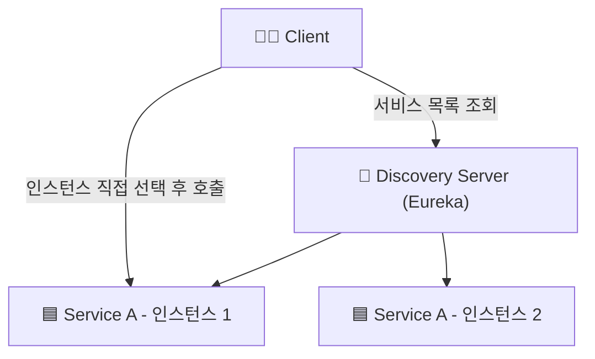
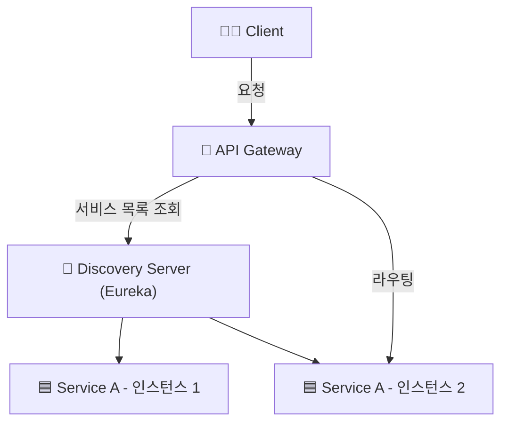
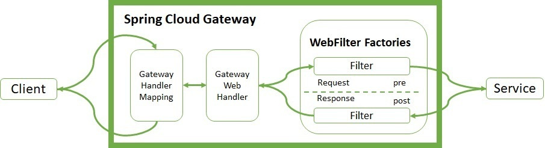

* * *

MSA 구조에서는 각 서비스들이 독립적으로 존재하기 때문에,이들 간의 원활한 통신을 위해 Service Discovery와 API Gateway가 필요합니다.   
서비스 디스커버리는 각 서비스의 위치를 찾는 방법을 제공하고, API 게이트웨이는 클라이언트와 서비스 간의 통신을 관리합니다.  
이 두 가지를 요소를 MSA에 적용해보겠습니다.

## ✅ Service Discovery
* MSA와 같은 분산 환경에서는 각 서비스가 서로를 찾고 통신하는 것이 중요합니다.
* 서비스 디스커버리는 각 서비스의 IP 주소나 포트 등 위치 정보를 중앙 레지스트리에 등록하고 관리함으로써, 서비스 간 동적인 위치 확인을 가능하게 합니다. 
* 서비스 디스커버리는 클라이언트가 서비스의 정보를 알 필요 없이 서비스를 찾을 수 있도록 도와줍니다.

<br>

### 📌 Client-Side-Discovery & Server-Side-Discovery

Service Discovery는 크게 두 가지 방식으로 나눌 수 있습니다.  

#### 1. Client-Side-Discovery

* 클라이언트가 서비스의 위치를 직접 찾는 방식입니다.
* 클라이언트는 서비스 레지스트리에서 서비스의 위치를 조회하고, 해당 서비스에 직접 요청을 보냅니다.

**장점**
* 각 서비스의 소스 레벨에서 Service Discovery를 구현할 수 있어 상대적으로 간단하다.
* 서비스별로 특성에 맞게 로드밸런싱 방식을 구성할 수 있다.

**단점**
* 클라이언트가 서비스의 위치를 알아야 하므로, 클라이언트와 서비스 간의 의존성이 증가한다.
* 서비스가 추가되거나 변경될 때 클라이언트도 함께 변경해야 한다.
* 언어가 다를경우 언어 및 프레임워크에 맞게 별도로 관리해줘야 한다.




<br> <br>

#### 2. Server-Side-Discovery

* 클라이언트가 서비스의 위치를 찾지 않고, 서버가 클라이언트의 요청을 받아서 서비스에게 라우팅 해주는 방식입니다.
* 서버는 서비스의 위치를 조회하고, 해당 서비스에 요청을 전달합니다.

**장점**
* 클라이언트와 서비스 간의 의존성이 줄어듭니다.
* 서비스가 추가되거나 변경될 때 클라이언트는 변경할 필요가 없습니다.
* 서버에서 로드밸런싱을 처리할 수 있습니다.

**단점**
* `api gateway`나 `load balancer`와 같은 추가적인 홉이 필요합니다.




<br> <br>

### 📌 Eureka를 이용한 Service Discovery 구현

`Spring Cloud Netflix Eureka`를 이용하여 `Discovery Server`를 구현하겠습니다.

#### 1. Eureka Server 의존성 추가

```groovy
dependencies {
    implementation 'org.springframework.cloud:spring-cloud-starter-netflix-eureka-server'
}
```

위와 같이 `eureka-server` 의존성을 추가합니다.

#### 2. Eureka Server 설정

```java
@SpringBootApplication
@EnableEurekaServer
public class EurekaApplication {

  public static void main(String[] args) {
    SpringApplication.run(EurekaApplication.class, args);
  }

}

```

`@EnableEurekaServer` 어노테이션을 추가하여 Eureka Server를 활성화합니다.


#### 3. application.yml 설정

```yaml
server:
  port: 0

spring:
  application:
    name: discovery-server

eureka:
  client:
    register-with-eureka: false
    fetch-registry: false
    serviceUrl:
      defaultZone: http://localhost:3333/eureka

  server:
    # 유레카 서버가 다른 유레카 서버와 동기화할 때 대기하는 시간
    wait-time-in-ms-when-sync-empty: 5

  instance:
    # 여러 개의 프로젝트를 실행할 때 유레카 서버에서 각각의 인스턴스를 식별하기 위해 설정
    # 'random.value를 활용하여 랜덤 값을 생성해 각 인스턴스를 고유하게 식별
    instance-id: ${spring.cloud.client.hostname}:${spring.application.instance_id:${random.value}}

management:
  endpoints:
    web:
      exposure:
        include: "*"

```
* `server.port`: 0으로 설정하여 랜덤 포트로 실행

`register-with-eureka`, `fetch-registry` 는
Eureka 서버가 자신을 다른 서버에 등록하거나, 레지스트리를 가져오지 않도록 설정하는 옵션입니다. 서버 자체이기 때문에 클라이언트 역할은 하지 않기 때문입니다.

<br>

### 📌 Eureka Client 설정

각 서비스에서 Eureka Client를 설정합니다.

#### 1. Eureka Client 의존성 추가

```groovy
dependencies {
    implementation 'org.springframework.cloud:spring-cloud-starter-netflix-eureka-client'
}
```

#### 2. Eureka Client 설정

```java
@SpringBootApplication
@EnableDiscoveryClient
public class UserApplication {

  public static void main(String[] args) {
    SpringApplication.run(UserApplication.class, args);
  }

}
```

`@EnableDiscoveryClient` 어노테이션을 추가하여 Eureka Client를 활성화합니다.


#### 3. application.yml 설정

```yaml
spring:
  application:
    name: user-service

eureka:
  instance:
    prefer-ip-address: true
    instance-id: ${spring.application.name}:${spring.application.instance_id:${random.value}}

  client:
    register-with-eureka: true
    fetch-registry: true
    serviceUrl:
      defaultZone: http://localhost:3333/eureka
```

<br> 

### 📌 Eureka Client 확인

``` text
2025-04-18T09:08:00.818+09:00  WARN 39916 --- [discovery-server] [get_localhost-0] c.n.eureka.cluster.ReplicationTask       : The replication of task API-GATEWAY/host.docker.internal:api-gateway:3334:Cancel@localhost failed with response code 404
2025-04-18T09:08:00.818+09:00  WARN 39916 --- [discovery-server] [get_localhost-0] c.netflix.eureka.cluster.PeerEurekaNode  : API-GATEWAY/host.docker.internal:api-gateway:3334:Cancel@localhost: missing entry.
2025-04-18T09:08:31.661+09:00  INFO 39916 --- [discovery-server] [nio-3333-exec-6] c.n.e.registry.AbstractInstanceRegistry  : Registered instance API-GATEWAY/api-gateway:d04cac58e950189a03a45299d80e55f2 with status UP (replication=false)
2025-04-18T09:08:32.183+09:00  INFO 39916 --- [discovery-server] [nio-3333-exec-7] c.n.e.registry.AbstractInstanceRegistry  : Registered instance API-GATEWAY/api-gateway:d04cac58e950189a03a45299d80e55f2 with status UP (replication=true)
```

서버가 정상적으로 등록되는것을 볼 수 있다.

멀티 모듈 환경에서 총 4개의 서비스를 실행했습니다.  


<br>

http://localhost:3333/eureka 에 접속하여 Eureka Server에 등록된 서비스들의 정보를 확인할 수 있습니다.


<br> <br>

## ✅ Api Gateway

* API Gateway는 클라이언트와 서비스 간의 통신을 관리하는 역할을 합니다.
* 클라이언트는 API Gateway에 요청을 보내고, API Gateway는 해당 요청을 적절한 서비스로 라우팅합니다.

즉, MSA의 서비스들에 접근하기 위해서는 모두 API Gateway를 거쳐야 합니다.  
API Gateway에 공통 관심사를 처리할 수 있습니다. (인증, 로깅, 모니터링 등)

<br>

### 📌 Netflix Zuul vs Spring Cloud Gateway

* **`Netflix Zuul`**
  * Netflix에서 개발한 API Gateway입니다.
  * Spring Cloud Netflix에 포함되어 있습니다.
  * Java 기반으로 작성되어 있으며, Spring Boot와 쉽게 통합할 수 있습니다.
  * 비동기 처리를 지원하지 않습니다.
  * HTTP 요청을 처리하는 데 적합합니다.


* **`Spring Cloud Gateway`**
  * Spring에서 개발한 API Gateway입니다.
  * Spring WebFlux를 기반으로 작성되어 있으며, 비동기 처리를 지원합니다.
  * HTTP 요청과 WebSocket 요청을 모두 처리할 수 있습니다.
  * Spring Boot와 쉽게 통합할 수 있습니다.


  Spring에서 `Netflix Zuul`에 관한 지원(유지보수)을 중지했기 때문에  `Spring Cloud Gateway`를 사용하겠습니다.


### 📌 Spring Cloud Gateway 동작 원리



1. Client는 Spring Cloud Gateway 서버로 요청을 보냄
2. Gateway Handler Mapping에서 요청이 매핑된다고 판단하면 Gateway Web Handler로 요청을 보냄
3. Gateway Web Handler는 매핑되는 요청을 위한 요청 필터 체인을 거쳐 요청을 실행함
4. 프록시된 서비스로 라우팅함
5. 프록시 서비스가 실행되고 Response를 반환한다.
6. Gateway Web Handler는 응답 필터 체인을 거쳐 클라이언트에게 응답을 반환함

위와 같은 과정들이 발생한다.  


<br>

### 📌 Spring Cloud Gateway 적용

#### 1. Spring Cloud Gateway 의존성 추가

```groovy
dependencies {
    implementation 'org.springframework.cloud:spring-cloud-starter-gateway'
}
```

<br>

#### 2. @EnableDiscoveryClient 어노테이션 추가

```java
@SpringBootApplication
@EnableDiscoveryClient
public class ApiGatewayApplication {

  public static void main(String[] args) {
    SpringApplication.run(ApiGatewayApplication.class, args);
  }

}
```


<br>

#### 3. application.yml 설정

```yaml
server:
  port: 0

spring:
  application:
    name: api-gateway
  main:
    web-application-type: reactive
  cloud:
    gateway:
      routes:
        - id: account-book-service
          uri: lb://account-book-service
          predicates:
            - Path=/account-book/**
        - id: user-service
          uri: lb://user-service
          predicates:
            - Path=/user/**

eureka:
  instance:
    prefer-ip-address: true
  client:
    register-with-eureka: true
    fetch-registry: true
    serviceUrl:
      defaultZone: http://localhost:3333/eureka


management:
  endpoints:
    web:
      exposure:
        include: "*"


auth:
  token:
    secretKey: sadfasdfsafdsadfsadfsafdsafdsafdsafdsafdsafdsafdsafdsafdsafsadfsadfsafdsadfsafdsadf
    accessTokenExpiry: 9900000
    refreshTokenExpiry: 604800000

```

* `server.port`: 0으로 설정하여 랜덤 포트로 실행
* `spring.cloud.gateway.routes`: 라우팅 설정
  * `id`: 라우팅 ID
  * `uri`: 서비스 URL (lb://{서비스 이름}) - Eureka에서 등록된 서비스 이름을 사용
  * `predicates`: 요청 경로에 대한 조건 설정
* `token`: api-gateway에서 인증 처리를 위한 설정값

<br>

#### 4. 인증 필터 구현 

```java
package com.moneyminder.filter;

import com.moneyminder.dto.JwtClaims;
import io.jsonwebtoken.Claims;
import io.jsonwebtoken.Jwts;
import io.jsonwebtoken.io.Decoders;
import io.jsonwebtoken.security.Keys;
import jakarta.annotation.PostConstruct;
import org.springframework.beans.factory.annotation.Value;
import org.springframework.cloud.gateway.filter.GatewayFilter;
import org.springframework.cloud.gateway.filter.factory.AbstractGatewayFilterFactory;
import org.springframework.http.HttpStatus;
import org.springframework.stereotype.Component;
import org.springframework.util.AntPathMatcher;
import org.springframework.util.PathMatcher;

import java.security.Key;
import java.util.List;

@Component
public class GlobalAuthFilter extends AbstractGatewayFilterFactory<GlobalAuthFilter.Config> {

    private final PathMatcher pathMatcher = new AntPathMatcher();
    private static final List<String> EXCLUDED_PATHS = List.of(
            "/api/auth/**",
            "/login/**",
            "/oauth2/**",
            "/swagger-ui/**",
            "/health/**",
            "/actuator/**"
    );

    @Value("${auth.token.secretKey}")
    private String secretKey;

    private Key key;

    @PostConstruct
    protected void init() {
        byte[] keyBytes = Decoders.BASE64.decode(secretKey);
        this.key = Keys.hmacShaKeyFor(keyBytes);
    }

    public GlobalAuthFilter() {
        super(Config.class);
    }

    @Override
    public GatewayFilter apply(Config config) {
        return (exchange, chain) -> {
            String path = exchange.getRequest().getPath().value();

            if (isExcludedPath(path)) {
                return chain.filter(exchange);
            }

            String token = exchange.getRequest().getHeaders().getFirst("Authorization");
            if (token == null || !token.startsWith("Bearer ")) {
                exchange.getResponse().setStatusCode(HttpStatus.UNAUTHORIZED);
                return exchange.getResponse().setComplete();
            }

            String jwt = token.substring(7);

            JwtClaims claims;
            try {
                claims = parseClaims(jwt);
            } catch (Exception e) {
                exchange.getResponse().setStatusCode(HttpStatus.UNAUTHORIZED);
                return exchange.getResponse().setComplete();
            }

            exchange.getRequest().mutate()
                    .header("X-USER-EMAIL", claims.email())
                    .header("X-USER-NAME", claims.name())
                    .header("X-USER-ROLE", claims.role())
                    .build();

            return chain.filter(exchange);
        };
    }

    private boolean isExcludedPath(String path) {
        return EXCLUDED_PATHS.stream().anyMatch(pattern -> pathMatcher.match(pattern, path));
    }

    private JwtClaims parseClaims(String token) {
        Claims claims = Jwts.parserBuilder()
                .setSigningKey(key)
                .build()
                .parseClaimsJws(token)
                .getBody();

        String email = claims.getSubject();
        String role = (String) claims.get("authority");
        String name = (String) claims.get("name");

        return JwtClaims.create(email, role, name);
    }

    public static class Config {
    }
}
```
API Gateway에서는 인증을 처리하기 위해 크게 `Global Filter`와 `Gateway Filter` 두 가지를 사용할 수 있습니다.


1. `Global Filter`  
- 모든 요청에 대해 작동하는 필터로, 전역적으로 적용됩니다.
- 예를 들어, 모든 요청의 로깅이나 공통적인 인증 작업을 수행할 때 사용됩니다.

2. `Gateway Filter`
- 특정 라우트에만 적용되는 필터로, 라우트에 지정된 필터로서, 요청과 응답의 처리를 세밀하게 조정할 수 있습니다.
- 예를 들어, 특정 서비스에만 적용될 요청 변환이나 헤더 추가 작업을 수행할 때 사용됩니다.

저는 `Global Filter`를 사용하여 모든 요청에 대해 인증을 처리하도록 구현했습니다.

인증처리하지 않을 Path를 제외하곤, 항상 토큰을 검증하여 헤더에 사용자 정보값을 담아 서비스로 라우팅해줍니다.

위와같이 처리한 이유는 다음과 같습니다.

1. 인증을 처리하는 서비스가 여러개일 경우, 각 서비스마다 인증을 처리하는 코드를 작성해야 합니다.
2. API Gateway에서 인증을 전역적으로 처리함으로써, 인증 로직의 중앙 집중화가 가능해집니다.   각 마이크로서비스는 인증에 대한 책임을 가지지 않고, 비즈니스 로직에만 집중할 수 있게 됩니다.


## ✅ 마치며
이번 포스팅에서는 `Service Discovery`와 `API Gateway`를 활용하여 MSA 환경에서의 서비스 간 통신 구조를 설계하고, 인증 필터까지 적용하는 과정을 다뤄보았습니다.

`Eureka`를 통해 동적으로 서비스 인스턴스를 등록/조회할 수 있도록 구성하였고,

`Spring Cloud Gateway`를 통해 서비스들 앞단에서 공통 처리를 할 수 있도록 구성하였습니다.

`Global Filter`를 활용하여 인증 필터를 구현하고, 토큰 검증 및 사용자 정보 전달을 간편하게 처리했습니다.

이제 기본적인 MSA 환경 구성이 완료되었고, 다음 단계로는
서비스 간 통신 방식(FEIGN, REST 등),
서킷 브레이커 및 장애 대응 등을 구현해보겠습니다.
