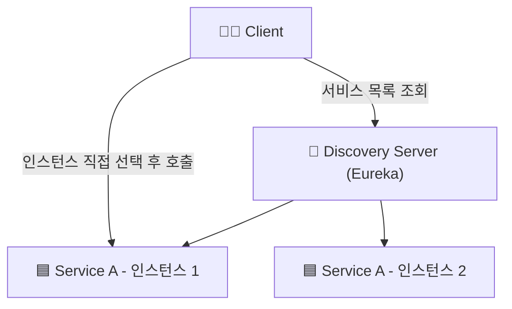
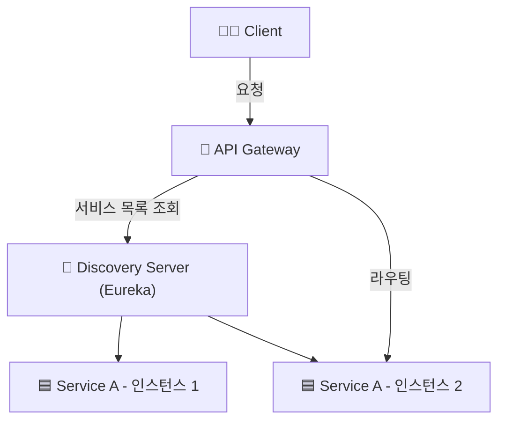

* * *

MSA 분리시 각 서비스들의 상호작용을 위해서는 서비스 디스커버리와 API 게이트웨이를 적용해야 합니다.
서비스 디스커버리는 각 서비스의 위치를 찾는 방법을 제공하고, API 게이트웨이는 클라이언트와 서비스 간의 통신을 관리합니다.
이 두 가지를 요소를 MSA에 적용해보겠습니다.

## ✅ Service Discovery
* MSA와 같은 분산 환경에서는 각 서비스가 서로를 찾고 통신하는 것이 중요합니다.
* 서비스 디스커버리는 서비스의 위치를 찾는 방법을 제공합니다. (예: IP 주소, 포트 번호 등)
* 서비스 디스커버리는 클라이언트가 서비스의 정보를 알 필요 없이 서비스를 찾을 수 있도록 도와줍니다.

<br>

### 📌 Client-Side-Discovery & Server-Side-Discovery

Service Discovery는 크게 두 가지 방식으로 나눌 수 있습니다.  

#### 1. Client-Side-Discovery

* 클라이언트가 서비스의 위치를 직접 찾는 방식입니다.
* 클라이언트는 서비스 레지스트리에서 서비스의 위치를 조회하고, 해당 서비스에 직접 요청을 보냅니다.

**장점**
* 각 서비스의 소스 레벨에서 Service Discovery를 구현할 수 있어 상대적으로 간단하다.
* 서비스별로 특성에 맞게 로드밸런싱 방식을 구성할 수 있다.

**단점**
* 클라이언트가 서비스의 위치를 알아야 하므로, 클라이언트와 서비스 간의 의존성이 증가한다.
* 서비스가 추가되거나 변경될 때 클라이언트도 함께 변경해야 한다.
* 언어가 다를경우 언어 및 프레임워크에 맞게 별도로 관리해줘야 한다.




<br> <br>

#### 2. Server-Side-Discovery

* 클라이언트가 서비스의 위치를 찾지 않고, 서버가 클라이언트의 요청을 받아서 서비스에게 라우팅 해주는 방식입니다.
* 서버는 서비스의 위치를 조회하고, 해당 서비스에 요청을 전달합니다.

**장점**
* 클라이언트와 서비스 간의 의존성이 줄어듭니다.
* 서비스가 추가되거나 변경될 때 클라이언트는 변경할 필요가 없습니다.
* 서버에서 로드밸런싱을 처리할 수 있습니다.

**단점**
* `api gateway`나 `load balancer`와 같은 추가적인 홉이 필요합니다.




<br> <br>

### 📌 Eureka를 이용한 Service Discovery 구현

`Spring Cloud Netflix Eureka`를 이용하여 `Discovery Server`를 구현하겠습니다.

#### 1. Eureka Server 의존성 추가

```groovy
dependencies {
    implementation 'org.springframework.cloud:spring-cloud-starter-netflix-eureka-server'
}
```

위와 같이 `eureka-server` 의존성을 추가합니다.

#### 2. Eureka Server 설정

```java
@SpringBootApplication
@EnableEurekaServer
public class EurekaApplication {

  public static void main(String[] args) {
    SpringApplication.run(EurekaApplication.class, args);
  }

}

```

`@EnableEurekaServer` 어노테이션을 추가하여 Eureka Server를 활성화합니다.


#### 3. application.yml 설정

```yaml
server:
  port: 0

spring:
  application:
    name: discovery-server

eureka:
  client:
    register-with-eureka: false
    fetch-registry: false
    serviceUrl:
      defaultZone: http://localhost:3333/eureka

  server:
    # 유레카 서버가 다른 유레카 서버와 동기화할 때 대기하는 시간
    wait-time-in-ms-when-sync-empty: 5

  instance:
    # 여러 개의 프로젝트를 실행할 때 유레카 서버에서 각각의 인스턴스를 식별하기 위해 설정
    # 'random.value를 활용하여 랜덤 값을 생성해 각 인스턴스를 고유하게 식별
    instance-id: ${spring.cloud.client.hostname}:${spring.application.instance_id:${random.value}}

management:
  endpoints:
    web:
      exposure:
        include: "*"

```
* `server.port`: 0으로 설정하여 랜덤 포트로 실행
* `register-with-eureka`: false로 설정하여 Eureka Server가 자신을 등록하지 않도록 설정
* `fetch-registry`: false로 설정하여 Eureka Server가 다른 Eureka Server의 레지스트리를 가져오지 않도록 설정

<br>

### 📌 Eureka Client 설정

각 서비스에서 Eureka Client를 설정합니다.

#### 1. Eureka Client 의존성 추가

```groovy
dependencies {
    implementation 'org.springframework.cloud:spring-cloud-starter-netflix-eureka-client'
}
```

#### 2. Eureka Client 설정

```java
@SpringBootApplication
@EnableDiscoveryClient
public class UserApplication {

  public static void main(String[] args) {
    SpringApplication.run(UserApplication.class, args);
  }

}
```

`@EnableDiscoveryClient` 어노테이션을 추가하여 Eureka Client를 활성화합니다.


#### 3. application.yml 설정

```yaml
spring:
  application:
    name: user-service

eureka:
  instance:
    prefer-ip-address: true
    instance-id: ${spring.application.name}:${spring.application.instance_id:${random.value}}

  client:
    register-with-eureka: true
    fetch-registry: true
    serviceUrl:
      defaultZone: http://localhost:3333/eureka
```

<br> 

### 📌 Eureka Client 확인

``` text
2025-04-18T09:08:00.818+09:00  WARN 39916 --- [discovery-server] [get_localhost-0] c.n.eureka.cluster.ReplicationTask       : The replication of task API-GATEWAY/host.docker.internal:api-gateway:3334:Cancel@localhost failed with response code 404
2025-04-18T09:08:00.818+09:00  WARN 39916 --- [discovery-server] [get_localhost-0] c.netflix.eureka.cluster.PeerEurekaNode  : API-GATEWAY/host.docker.internal:api-gateway:3334:Cancel@localhost: missing entry.
2025-04-18T09:08:31.661+09:00  INFO 39916 --- [discovery-server] [nio-3333-exec-6] c.n.e.registry.AbstractInstanceRegistry  : Registered instance API-GATEWAY/api-gateway:d04cac58e950189a03a45299d80e55f2 with status UP (replication=false)
2025-04-18T09:08:32.183+09:00  INFO 39916 --- [discovery-server] [nio-3333-exec-7] c.n.e.registry.AbstractInstanceRegistry  : Registered instance API-GATEWAY/api-gateway:d04cac58e950189a03a45299d80e55f2 with status UP (replication=true)
```

서버가 정상적으로 등록되는것을 볼 수 있다.

멀티 모듈 환경에서 총 4개의 서비스를 실행했습니다.  


<br>

http://localhost:3333/eureka 에 접속하여 Eureka Server에 등록된 서비스들의 정보를 확인할 수 있습니다.


<br> <br>

## ✅ Api Gateway

