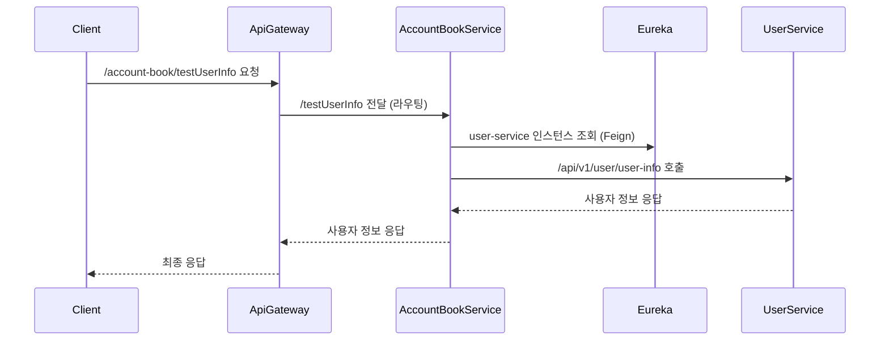

* * *

MSA 구조에서는 서비스들이 독립적으로 운영되기 때문에, 서로 간에 데이터를 주고받을 일이 굉장히 많습니다.  
이번 글에서는 서비스 간 통신을 훨씬 더 쉽게 만들어주는 OpenFeign을 활용해서, 실제로 어떻게 구현했는지 정리해보려 합니다.

<br>

---
## ✅ MSA 환경에서의 서비스 간 통신

MSA에서는 다음과 같은 다양한 방식으로 다른 서비스에 요청을 보낼 수 있습니다.  

- **REST Template** : 과거 가장 많이 쓰던 HTTP 클라이언트
- **WebClient** : 비동기 통신을 지원하는 Spring WebFlux 기반 클라이언트
- **Feign Client** : 인터페이스 기반 선언형 HTTP 클라이언트

<br>

### 📌 RestTemplate의 한계

`RestTemplate`은 오랫동안 표준처럼 사용됐지만,  직접 HTTP 요청 객체를 만들고, 예외처리하고, 실패 복구까지 모두 신경 써야 했습니다.

더불어 스프링 5 이후부터는 공식적으로 WebClient 사용이 권장되고 있습니다.

**문제점**
- 코드가 장황하고 중복이 많아짐
- 장애 복구 로직이 복잡함
- 서비스 이름 기반 연결이 불편함 (Eureka 연동 불편)
- 비동기 처리의 복잡함

그래서 더 간결하고 유연한 방식이 필요했습니다.

<br>

### 📌 Feign Client의 등장

`Feign Client`는 이런 문제를 아주 깔끔하게 해결할 수 있습니다.

- HTTP 요청을 마치 메서드 호출하듯 선언가능
- Eureka 연동을 통한 서비스 이름 기반 호출
- 코드 간결화 및 유지보수성 향상
- Ribbon, Resilience4j와 통합 가능

<br><br>

--- 
## ✅ OpenFeign 이란?

OpenFeign은 Netflix Feign 프로젝트를 기반으로 Spring Cloud에서 공식 지원하는 선언형 HTTP 클라이언트입니다.  
Java 인터페이스와 어노테이션을 통해 쉽게 REST API 호출을 정의할 수 있으며,  
복잡한 HTTP 통신 로직을 직접 작성하지 않고도 서비스 간 통신을 간결하게 구현할 수 있습니다.

### 📌 OpenFeign의 주요 특징

- 선언형 API 호출
- Eureka, Ribbon, Resilience4j와 통합
- 자동 로드밸런싱 지원
- Fallback으로 장애 복구 지원
- Decoder, Retry, Timeout 같은 고급 커스터마이징 가능

### 📌 OpenFeign을 사용하는 이유

MSA에서는 서비스 IP나 포트가 자주 바뀌기 때문에,
직접 URL이나 포트를 지정하여 요청을 보내는건 적합하지 않습니다.

OpenFeign을 사용하면,  IP 대신 서비스 이름으로 통신할 수 있고,  
통신 실패 시 자연스럽게 대체 로직으로 복구하고  코드도 훨씬 깔끔하게 유지할 수 있습니다.  

결론적으로, MSA 아키텍처에 가장 잘 어울리는 통신 방법이라 선택하게 됐습니다.

<br> <br>


--- 
## ✅ OpenFeign 고급 기능

| 기능            | 설명                         |
| :------------ | :------------------------- |
| Fallback      | 서비스 실패 시 대체 로직 처리 (서킷브레이커) |
| Timeout 설정    | 요청/응답 타임아웃 조정              |
| Retry 설정      | 실패 시 재시도 횟수 설정             |
| Error Decoder | 커스텀 에러 핸들링 구현              |

### 📌 Fallback 설정 예시

```java
@FeignClient(
        name = "user-service",
        path = "/api/v1/user/",
        fallback = UserFeignFallback.class
)
public interface UserFeignClient {
    @GetMapping("/user-info")
    UserApiResponse<UserFeignResponse> getUserInfo(@RequestParam String email);
}

@Component
public class UserFeignFallback implements UserFeignClient {
    @Override
    public UserApiResponse<UserFeignResponse> getUserInfo(String email) {
        return new UserApiResponse<>(500, "Fallback: 사용자 정보 조회 실패", null);
    }
}
```

### 📌 Timeout 설정 예시

```java
@Configuration
public class UserFeignConfig {
    @Bean
    public Request.Options requestOptions() {
        return new Request.Options(5000, 10000); // 연결 타임아웃 5초, 응답 타임아웃 10초
    }
}
```
### 📌 Retry 설정 예시

```java
@Configuration
public class UserFeignConfig {
    @Bean
    public Retryer retryer() {
        return new Retryer.Default(1000, 5000, 3); // 초기 대기 시간 1초, 최대 대기 시간 5초, 최대 재시도 횟수 3회
    }
}
```

### 📌 Error Decoder 설정 예시

```java
@Configuration
public class UserFeignConfig {
    @Bean
    public ErrorDecoder errorDecoder() {
        return new CustomErrorDecoder();
    }
}
public class CustomErrorDecoder implements ErrorDecoder {
    @Override
    public Exception decode(String methodKey, Response response) {
        // 커스텀 에러 처리 로직
        return new BaseException("Feign Error: " + response.status());
    }
}
```

### 📌 Decoder 설정 예시

```java
@RequiredArgsConstructor
public class UserApiResponseDecoder implements Decoder {

    private final ObjectMapper objectMapper;

    @Override
    public Object decode(Response response, Type type) throws IOException {
        return objectMapper.readValue(response.body().asInputStream(), objectMapper.getTypeFactory().constructType(type));
    }
}
```

<br><br>

--- 
## ✅ OpenFeign 적용하기

**UserService ↔ AccountBookService** 간 통신을 OpenFeign으로 구현합니다.

<br>

### 📌 1. 의존성 추가

```groovy
dependencies {
    implementation 'org.springframework.cloud:spring-cloud-starter-openfeign'
}
```

### 📌 2. @EnableFeignClients 추가
```java
@EnableFeignClients
@SpringBootApplication
public class AccountBookApplication {
  public static void main(String[] args) {
    SpringApplication.run(AccountBookApplication.class, args);
  }
}
```

### 📌  3. Feign Client 인터페이스 작성
```java
@FeignClient(
        name = "user-service",
        path = "/api/v1/user/",
        configuration = UserFeignConfig.class
)
public interface UserFeignClient {

    @GetMapping("/user-info")
    UserApiResponse<UserFeignResponse> getUserInfo(@RequestParam String email);
}

```

### 4.  📌 서비스를 호출하는 곳에서 선언 및 사용

```java
priavte final UserFeignClient userFeignClient;

public UserFeignResponse testUserInfo(String email) {
  UserApiResponse<UserFeignResponse> userInfo = userFeignClient.getUserInfo(email);

  if (userInfo.getCode() != 200) {
    throw new BaseException(userInfo.getMessage());
  }
        return userInfo.getData();
    }
```

<br> <br>

## ✅ OpenFeign 통신 흐름



<br><br>

---
## ✅ OpenFeign 응답 커스텀 마이징
기본적으로 OpenFeign은 서버로부터 받은 HTTP 응답을 자동으로 디코딩하여 객체로 변환해줍니다.  
하지만, 제 프로젝트에서는 다음과 같은 특수한 형태의 응답 포맷을 사용하고 있습니다.

```json
{
  "code": 200,
  "message": "성공",
  "data": {
    "name": "홍길동",
    "email": "hong@example.com"
  }
}
```
`code` : 응답 코드 (성공/실패 판단)  
`message` : 응답 메시지  
`data`: 실제 응답  데이터

### 📌 문제점
Feign의 기본 디코더는 data 필드까지 자동으로 파싱해주지 않습니다.  
제가 원하는 형태는 `data`필드의 값을 객체로 변환하여 응답받는 것이기 때문에 이에 맞게 코드를 추가하도록 하겠습니다.

### 📌 해결 방법

1. UserApiResponse
   → 공통 응답 포맷을 담기 위한 Generic 클래스

```java
@Getter
@Setter
@NoArgsConstructor
public class UserApiResponse<T> {
    private int code;
    private String message;
    private T data;

    public boolean isSuccess() {
        return code == 200;
    }
}


```

2. UserApiResponseDecoder → Feign 응답을 읽어와 ObjectMapper를 사용해 UserApiResponse<T>로 변환
```java
@RequiredArgsConstructor
public class UserApiResponseDecoder implements Decoder {

    private final ObjectMapper objectMapper;

    @Override
    public Object decode(Response response, Type type) throws IOException {
        return objectMapper.readValue(response.body().asInputStream(), objectMapper.getTypeFactory().constructType(type));
    }
}
```

3. UserFeignConfig → Feign Client에 이 디코더를 적용

```java
@Configuration
public class UserFeignConfig {

    @Bean
    public Decoder feignDecoder(ObjectMapper objectMapper) {
        return new UserApiResponseDecoder(objectMapper);
    }
}

```

4. UserFeignClient -> configuration에 UserFeignConfig를 추가

```java
@FeignClient(
    name = "user-service",
    path = "/api/v1/user/",
    configuration = UserFeignConfig.class
)
public interface UserFeignClient {

    @GetMapping("/user-info")
    UserApiResponse<UserFeignResponse> getUserInfo(@RequestParam String email);
}
```

5. UserFeignResponse→ 실제 응답 데이터의 형태를 담기 위한 클래스

```java
public record UserFeignResponse(
    String name,
    String email
) {}

```
위와같이 data 필드의 값만 객체로 변환하여 응답받을 수 있도록 구현했습니다.  
서버별로 응답값이 다를 수 있기 때문에, 위와 같이 각 서버에 맞는 decoder를 구현하여 사용하면 됩니다.

### 📌 정리

| 역할                       | 설명                                |
| :----------------------- | :-------------------------------- |
| `UserApiResponse<T>`     | 서버로부터 오는 공통 응답 형태를 표현             |
| `UserApiResponseDecoder` | JSON 응답을 `UserApiResponse<T>`로 변환 |
| `UserFeignConfig`        | OpenFeign에 커스텀 디코더 등록             |
| `UserFeignClient`        | UserService와 통신할 인터페이스            |
| `UserFeignResponse`      | 실제 필요한 사용자 정보만 추출하는 DTO           |


이렇게 설계함으로써 얻을 수 이점은 다음과 같습니다. 

- 비즈니스 코드에서는 응답 객체를 직접 파싱하거나 변환하는 불필요한 로직을 제거
- isSuccess() 메서드로 간편하게 응답 성공 여부를 체크할 수 있음
- 추후 다양한 서비스들과 통신할 때 일관된 응답 포맷 관리가 가능

<br> <br>

---
## ✅ 마치며
이번 포스팅에서는 OpenFeign을 이용해 서비스 간 통신을 선언형으로 쉽게 구현하는 방법을 다뤘습니다.

MSA 환경에서는 각 서비스가 독립적이기 때문에, 서비스 간 통신을 얼마나 깔끔하게 설계하느냐가 유지보수성과 안정성에 큰 영향을 미칩니다.

OpenFeign을 통해 서비스 간 연결을 최소한의 코드로 구성하면서,
서비스 확장성까지 고려할 수 있게 되었습니다.

다음 포스팅에서는 config 서버를 활용한 설정 파일 관리에 대해 정리하겠습니다.
