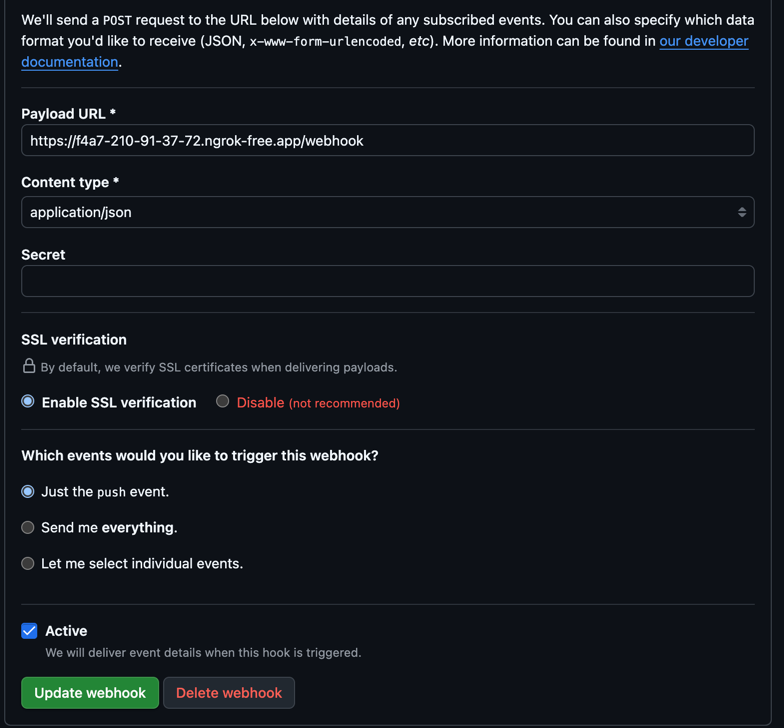

---

MSA 구조에서 각 서비스는 독립적으로 배포되고 실행되기 때문에, 서비스마다 설정 파일(`application.yml`)을 따로 관리해야 합니다.    
하지만 서비스가 많아질수록 설정 파일의 중복, 불일치, 보안 이슈 등 다양한 문제가 생깁니다.

이번 포스팅에서는 **Spring Cloud Config Server**를 도입해  
**설정 파일을 중앙에서 일괄 관리**하고,  

**서비스 변경 없이도 설정을 실시간 반영**할 수 있는 구조를 어떻게 만들었는지 정리하겠습니다.

<br>

---

## ✅ 설정 파일 관리의 문제점

전통적인 설정 방식에서는 서비스마다 각자의 `application.yml`이나 `application.properties`를 가지고 있으며,  
이는 다음과 같은 문제를 유발합니다:

- 버전 관리 불가능 (이전 설정으로 롤백 어려움)
- 서비스마다 설정이 조금씩 다름 → 장애 발생 가능성 증가
- 공통 설정 복사-붙여넣기 → 변경사항 일괄 반영 어려움
- 보안 정보(예: DB 비밀번호)를 Git에 올리기 어려움
- 설정 변경시 재배포 필요

자세한 상황을 가정해보겠습니다.

<br>

### 1️⃣ 설정 파일 수동 수정 -> 버전 불일치
#### 상황
`user-service`와 `account-book-service` 두 서비스가 같은 OAuth 서버 설정을 사용하고 있다고 가정해보겠습니다.

두 서비스 모두 `application.yml`에 다음과 같은 설정이 있습니다.

```yaml
oauth:
  client-id: my-client-id
  client-secret: my-secret
  token-uri: https://auth.example.com/oauth/token
```

#### 문제점
- `user-service`에서 OAuth 서버의 `client-secret`을 변경했지만, `account-book-service`는 변경하지 않았습니다.
- 이로 인해 두 서비스 간에 OAuth 인증 정보가 불일치하게 됩니다.

이럴 경우 인증 요청이 실패하고 원인을 찾는 데 많은 시간이 걸릴 수 있습니다.   
변경포인트가 최신화 되어있지 않은 경우 찾기 어려운 상황이 발생할수도 있습니다.

<br>

### 2️⃣ 서비스 간 설정 포맷 불일치

#### 상황
모든 서비스가 같은 형식의 `kafka 설정`을 가져야 하는데, 각 팀에서 조금씩 다른 키값이나 구조로 작성해 둔 경우가 종종 있습니다.

```yaml
# user-service.yml
kafka:
  bootstrap-servers: localhost:9092
  topic:
    name: user-topic
    group-id: user-group

# account-book-service.yml
kafka:
  servers: localhost:9092
  topic:
    name: account-book-topic
    group-id: account-book-group
```

#### 문제점

같은 kafka 클러스터를 사용하고 있지만,  
설정 키 이름이 다르기 때문에 공통 모듈로 분리하기도 어렵고,  
문서화도 일관되게 하기가 어렵습니다.


<br>

위와 같은 문제점들을 해결하기 위해, `Spring Cloud Config Server`를 도입하여 적용해보겠습니다.

<br> <br>

---

## ✅ Spring Cloud Config Server란?

`Spring Cloud Config`는 서버 외부에서 설정 파일을 한번에 관리해주는 라이브러리입니다. 

### 주요 기능

| 기능 | 설명 |
|------|------|
| 원격 설정 관리 | Git에 저장된 설정을 서버가 읽어 제공 |
| 설정 동기화 | 모든 서비스에 동일한 설정을 공유 가능 |
| 동적 반영 | Spring Bus와 연동 시 실시간으로 설정 변경 가능 |
| 보안 구성 | 암호화된 설정 정보 관리 가능 |


위와 같이 cloud config 환경을 구성하게 되면 설정 파일들을 하나의 서버에서 관리할 수 있고,
설정 파일이 변경되어도 재빌드 & 재배포 없이 운영이 가능합니다.

<br>


---

## ✅ 구성 구조

- `config-repo`: Git 저장소. 설정 파일을 이곳에서 관리
- `ConfigServer`: 설정 파일을 읽어 서비스에 제공
- `각 서비스`: 부팅 시 Config Server에서 설정을 가져옴

여기서 config-repo는 Git 저장소로 실제 서비스들의 설정 파일이 저장되는 Repository 이고  
ConfigServer는 이 Repository를 읽어 서비스에 제공하는 역할을 합니다. (멀티모듈에 포함됨)

<br>


---

## ✅ Spring Cloud Config 적용하기

### 📌1. Config Git Repository 생성


📁 config-repo   
├── config  
├──── account-book-service  
├──── user-service  
├──── api-gateway  
├──── eureka  

각 서비스 별로 폴더를 생성했고, 

하위에 각 서비스에서 쓸 설정파일을 작성합니다.

yml 파일 이름은 `application.yml`로 사용하셔도 되고, 저처럼 서비스 이름으로 해도 됩니다.  
(서비스 이름으로 하면, `spring.application.name`과 일치해야 합니다.)

### 📌 2. Config Server 모듈 생성 및 의존성 추가

`spring-cloud-starter-config` 의존성을 추가합니다.

```
dependencies {
  implementation 'org.springframework.cloud:spring-cloud-config-server'
}
```

`@EnableConfigServer` 어노테이션으로 Config 서버를 활성화합니다.

```
@EnableConfigServer
@SpringBootApplication
public class ConfigServerApplication {
  public static void main(String[] args) {
    SpringApplication.run(ConfigServerApplication.class, args);
  }
}
```

`application.yml`에 Git 저장소 설정을 합니다.

```
server:
  port: 8888

spring:
  application:
    name: config-server
  cloud:
    config:
      server:
        git:
          uri: https://github.com/GangEunzzang/moneyminder-config
          search-paths: config/**
          default-label: main

management:
  endpoints:
    web:
      exposure:
        include: "*"
  endpoint:
    shutdown:
      enabled: true
```
* Git이 아닌 로컬 파일 시스템도 가능: `file:///path/to/config-repo`
* `search-paths`는 Git 저장소에서 설정 파일을 찾을 경로
* `default-label`은 Git 브랜치 이름 (main, master 등)


<br>

### 📌 3. 각 서비스에서 설정 사용

각 서비스에는 `spring-cloud-starter-config` 의존성을 추가합니다.

```
dependencies {
  implementation 'org.springframework.cloud:spring-cloud-starter-config'
}
```

`application.yml`에 Config Server의 URL을 설정합니다.

```
spring:
  application:
    name: eureka
  profiles:
    active: local
  config:
    import: optional:configserver:http://localhost:8888
```

만약 `application.yml`이 아닌 `bootstrap.yml`에 설정하면,

설정파일을 불러오는 시점을 application 부팅 시점으로 변경할 수 있습니다.  
(부트스트랩 단계에서 설정을 불러옴)

그러나 `Spring Boot 2.4` 이상부터는 `bootstrap.yml`을 사용하지 않고,  
`spring.config.import`를 사용하여 설정을 불러올 수 있어서 권장되지 않습니다.


<br>

### 📌 4. 설정 파일 호출 테스트

이제 config Server에 적용된 설정 파일을 호출해보겠습니다.

```http request
### user-service의 설정 파일 호출
GET localhost:8888/user-service/local,common,oauth2
```


위와 같이 설정한 파일 값을 json 형태로 응답 받을 수 있습니다. 

---

<br> <br>

## ✅ 동적으로 설정 변경하기 

설정 파일을 변경한 뒤 서버를 재시작하지 않고도 반영하려면 `Spring Cloud Bus`를 사용 할 수 있습니다.  

하지만, Spring Cloud Bus를 연동하기 위해선 rabbitMq의 연동이 필요해서 배보다 배꼽이 커지는 기분이라 나만의 방법대로 구현해 봤습니다.

제가 구성한 흐름은 다음과 같습니다.

###  1️⃣ Config Server 모듈에 refresh Controller 구현

```java
package com.moneyminder.presentation;

import lombok.Data;
import lombok.RequiredArgsConstructor;
import lombok.extern.slf4j.Slf4j;
import org.springframework.cloud.client.ServiceInstance;
import org.springframework.cloud.client.discovery.DiscoveryClient;
import org.springframework.http.HttpEntity;
import org.springframework.http.HttpHeaders;
import org.springframework.http.MediaType;
import org.springframework.http.ResponseEntity;
import org.springframework.web.bind.annotation.PostMapping;
import org.springframework.web.bind.annotation.RequestBody;
import org.springframework.web.bind.annotation.RequestMapping;
import org.springframework.web.bind.annotation.RestController;
import org.springframework.web.client.RestTemplate;

import java.util.HashSet;
import java.util.List;
import java.util.Set;

@Slf4j
@RequiredArgsConstructor
@RestController
@RequestMapping("/webhook")
public class GitWebHookController {

    private static final String CONFIG_PREFIX = "config/";
    private static final String REFRESH_ENDPOINT = "/actuator/refresh";

    private final DiscoveryClient discoveryClient;
    private final RestTemplate restTemplate = new RestTemplate();

    @PostMapping
    public ResponseEntity<String> handleWebhook(@RequestBody WebhookPayload payload) {
        Set<String> affectedServices = extractServiceNamesFrom(payload);

        if (affectedServices.isEmpty()) {
            log.info("📭 변경된 서비스 없음 (스킵)");
            return ResponseEntity.ok("No services to refresh.");
        }

        affectedServices.forEach(this::refreshService);

        return ResponseEntity.ok("Webhook processed.");
    }

    private Set<String> extractServiceNamesFrom(WebhookPayload payload) {
        Set<String> serviceNames = new HashSet<>();

        if (payload.getCommits() == null) return serviceNames;

        for (Commit commit : payload.getCommits()) {
            if (commit.getModified() == null) continue;

            for (String path : commit.getModified()) {
                if (path != null && path.startsWith(CONFIG_PREFIX)) {
                    String[] parts = path.split("/");
                    if (parts.length >= 2) {
                        serviceNames.add(parts[1].trim());
                    }
                }
            }
        }

        return serviceNames;
    }

    private void refreshService(String serviceName) {
        List<ServiceInstance> instances = discoveryClient.getInstances(serviceName);

        if (instances.isEmpty()) {
            log.warn("❗ Eureka에서 '{}' 서비스 인스턴스를 찾을 수 없습니다.", serviceName);
            return;
        }

        HttpHeaders headers = new HttpHeaders();
        headers.setContentType(MediaType.APPLICATION_JSON);

        HttpEntity<String> entity = new HttpEntity<>("", headers);

        for (ServiceInstance instance : instances) {
            String url = instance.getUri() + REFRESH_ENDPOINT;
            try {
                restTemplate.postForEntity(url, entity, String.class);
                log.info("✅ 설정 리프레시 완료 → [{}] @ [{}]", serviceName, url);
            } catch (Exception e) {
                log.error("❌ 설정 리프레시 실패 → [{}] @ [{}]: {}", serviceName, url, e.getMessage(), e);
            }
        }
    }

    @Data
    public static class WebhookPayload {
        private List<Commit> commits;
    }

    @Data
    public static class Commit {
        private List<String> modified;
    }
}

```

위 로직은 요청이 `git WebHook`으로부터 요청이 들어오면 커밋 메세지를 살피고 수정된 파일에서. 
service 이름을 추출하여 해당 서비스의 `refresh` 엔드포인트를 호출합니다.

<br> 

### 2️⃣ Git WebHook 설정

GitHub에서 WebHook을 설정합니다.


여기서 payload URL은 `ngrok`를 사용하여 외부에서 접근할 수 있도록 설정했습니다.

<br>


위와 같이 간단하게 컨트롤러를 구현하고 WebHook을 설정하면, Spring Cloud Bus를 사용하지 않고도
동적 Refresh를 적용 할 수 있습니다.


<br>

---

## ✅ 마치며

이번 포스팅에서는 Config Server를 이용한 설정 관리 방법을 소개했습니다.  
다음 포스팅에서는 `Circuit Breaker` 와 `FallBack` 를 이용한 장애 복구 방법에 대해 알아보겠습니다.  
