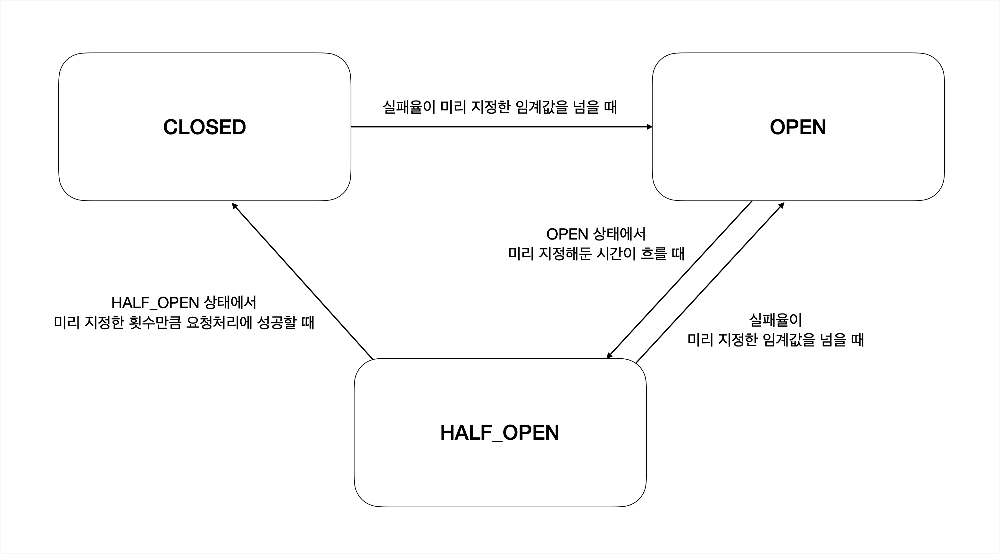

MSA 환경에서 하나의 서비스 장애가 전체 시스템에 영향을 미치는 상황을 방지하기 위해 **Circuit Breaker** 패턴이 자주 사용됩니다.  
이번 포스팅에서는 Spring Cloud + Resilience4j를 사용하여 장애 발생 시 **자동으로 우회**하거나, **예외를 처리**하는 구조를 어떻게 구성했는지 정리해보겠습니다.

---

## ✅ Circuit Breaker란?

Circuit Breaker는 외부 시스템 호출 실패가 일정 횟수 이상 발생했을 때,  
해당 호출을 중단하고 빠르게 실패(Fail Fast)하도록 도와주는 보호 장치입니다.

| 상태       | 설명                                               |
|------------|----------------------------------------------------|
| Closed     | 정상 동작 상태. 오류 누적 시 Open 상태로 전환       |
| Open       | 요청을 차단하고 즉시 예외 반환. 일정 시간 후 Half-Open 시도 |
| Half-Open  | 일정 수의 요청을 테스트. 성공 시 Closed로, 실패 시 Open 유지 |

이러한 상태 전환을 통해 시스템 전체가 다운되는 사태를 방지할 수 있습니다.



여기서 상태를 전환하는 기준은 `실패율`과 `슬라이딩 윈도우`를 사용합니다.

- **실패율(Failure Rate)**: 최근 N개의 호출 중 실패한 비율. 예를 들어, 10번 호출 중 6번 실패하면 실패율은 60%입니다.
- **슬라이딩 윈도우(Sliding Window)**: 최근 N개의 호출을 기준으로 실패율을 계산합니다. 예를 들어, 10번 호출을 기준으로 하면, 가장 최근 10번의 호출만 고려합니다.

### 📌 Circuit Breaker의 필요성

MSA 구조에서는 서비스 간의 의존성이 높아지기 때문에, 하나의 서비스 장애가 전체 시스템에 영향을 미칠 수 있습니다.
이때 Circuit Breaker를 사용하면 다음과 같은 이점이 있습니다:

- **장애 전파 방지**: 하나의 서비스 장애가 다른 서비스로 전파되는 것을 막을 수 있습니다.
- **빠른 실패 처리**: 장애가 발생했을 때 즉시 예외를 반환하여 시스템이 멈추지 않도록 합니다.
- **복구 시간 단축**: 장애가 발생해도 일정 시간 후 자동으로 복구를 시도할 수 있습니다.
- **서비스 안정성 향상**: 장애 발생 시 사용자에게 기본 응답을 제공하여 서비스의 신뢰성을 높입니다.

예를 들어, `user-service`를 호출하는 `account-book-service`가 있다고 가정해봅시다.  
`user-service`가 장애로 인해 응답하지 않는 상황에서, `account-book-service`가 계속해서 호출을 시도하면 전체 시스템이 느려지거나 다운될 수 있습니다.

이때 Circuit Breaker를 적용하면, `user-service`가 일정 횟수 이상 실패하면 더 이상 호출하지 않고,
대신 Fallback 메서드를 호출하여 사용자에게 기본 응답을 제공할 수 있습니다.


<br>

### 📌 Fallback

Fallback은 Circuit Breaker가 Open 상태일 때, 대체 응답을 제공하는 메커니즘입니다.  

`board-service`의 게시판 조회를 특정 서비스 에서 호출한다고 가정해보겠습니다.  

`board-service`가 서버 다운이 되어 응답하지 않는 상황에서, fallback을 미리 적용해두어, 

메모리에 저장된 가장 최근 게시글 목록을 반환해주어, 사용자는 게시판 조회를 시도했을 때, 서버가 다운되었다는 메시지 대신 최근 게시글 목록을 볼 수 있게 됩니다.


---

<br> <br>


## ✅ Resilience4j + Spring Boot 적용하기

### 📌 1. 의존성 추가

spring-cloud-starter-circuitbreaker-resilience4j 의존성을 추가합니다.

```groovy
implementation 'org.springframework.cloud:spring-cloud-starter-circuitbreaker-resilience4j'
```

---

<br>

### 📌 2. 설정 추가

application.yml에 Circuit Breaker 관련 설정을 추가합니다.

```yaml
management:
  endpoints:
    web:
      exposure:
        include: "*"
  endpoint:
    health:
      show-details: always

  health:
    circuitbreakers:
      enabled: true


resilience4j:
  circuitbreaker:
    configs:
      default:
        failure-rate-threshold: 50
        slow-call-rate-threshold: 80
        slow-call-duration-threshold: 10s
        permitted-number-of-calls-in-half-open-state: 3
        max-wait-duration-in-half-open-state: 0
        sliding-window-type: COUNT_BASED
        sliding-window-size: 10
        minimum-number-of-calls: 10
        wait-duration-in-open-state: 10s
    instances:
      user-service-circuit-breaker:
          base-config: default
```

이 설정은 Circuit Breaker의 기본 동작 방식을 정의합니다.

- `failure-rate-threshold`: 실패율이 이 값을 초과하면 Circuit Breaker가 Open 상태로 전환
- `slow-call-rate-threshold`: 느린 호출 비율이 이 값을 초과하면 Circuit Breaker가 Open 상태로 전환
- `slow-call-duration-threshold`: 느린 호출로 간주되는 시간
- `permitted-number-of-calls-in-half-open-state`: Half-Open 상태에서 허용되는 호출 수
- `max-wait-duration-in-half-open-state`: Half-Open 상태에서 호출이 허용될 때 최대 대기 시간
- `sliding-window-type`: 슬라이딩 윈도우의 유형을 설정합니다. COUNT_BASED는 호출 수를 기준
- `sliding-window-size`: 슬라이딩 윈도우의 크기를 설정
- `minimum-number-of-calls`: Circuit Breaker가 상태를 전환하기 위해 필요한 최소 호출 수.
- `wait-duration-in-open-state`: Open 상태에서 Circuit Breaker가 Half-Open 상태로 전환되기까지 대기하는 시간
- `instances`: 임의의 Circuit Breaker 인스턴스를 정의할 수 있습니다.  
  여기서는 `user-service-circuit-breaker`라는 이름으로 기본 설정을 참조합니다.
- `base-config`: 위에서 설정한 default 설정을 참조

---

<br>

### 📌 3. 서비스에 적용

Circuit Breaker를 적용하려면 `@CircuitBreaker` 어노테이션을 사용합니다.

```java

@FeignClient(
  name = "user-service",
  path = "/api/v1/user/",
  configuration = UserFeignConfig.class
)
@CircuitBreaker(name = "userservice-circuit-breaker", fallbackMethod = "getUserInfoFallback")
public interface UserFeignClient {

  @GetMapping("/user-info")
  UserApiResponse<UserFeignResponse> getUserInfo(@RequestParam String email);

  default UserApiResponse<UserFeignResponse> getUserInfoFallback(String email, Throwable t) {
    return new UserApiResponse<>(
      200,
      "Fallback triggered",
      UserFeignResponse.builder()
        .email(email)
        .name("Fallback User")
        .build()
    );
  }

}
```

저는 feign 어노테이션에 fallback을 적용하지 않고,  
@CircuitBreaker 어노테이션에 `fallbackMethod` 속성을 사용하여 Fallback 메서드를 지정했습니다.  

두 가지 방법 모두 사용 가능하니 따로 선택하셔도 됩니다.

```java
@Component
public class UserFeignFallback implements UserFeignClient {

    @Override
    public UserApiResponse<UserFeignResponse> getUserInfo(String email) {
        return new UserApiResponse<>(200,
                "fallback response",
                UserFeignResponse.builder()
                        .name("Fallback User")
                        .email(email)
                        .build());
    }
}
```
---

<br> <br>


## ✅ Circuit Breaker 시나리오 테스트

Circuit Breaker가 정상적으로 동작하는지 테스트 해보겠습니다.

### 📌 테스트 환경 설정

- Sliding Window 타입 : COUNT_BASED (요청 개수 기준)
- Sliding Window 크기 : 10 (최근 10개 요청 기준으로 상태 판단)
- failure call 비율 : 50%
- slow call 비율 : 80%
- Open → Half-Open 최소 대기 시간 : 10초
- Half-Open 상태 테스트 요청 개수 : 3개

---

### 1️⃣ Closed → Open 전환 테스트 (10개 요청 실패 시)

- **테스트 방식**:
  호출받는 서비스(Member-Service)를 중지한 후, 호출하는 서비스(Board-Service)에서 연속으로 10개의 요청 전송

- **기대 결과**:
  10번째 요청이 실패한 직후 Circuit Breaker 상태가 Closed에서 Open으로 전환

- **테스트 결과**:
  - 9번째 요청 후 상태 확인:  
    ```json
    {
    "state": "CLOSED",
    "failedCalls": 9
    }
    ```

  - 10번째 요청 후 상태 확인:
    ```json
    {
    "state": "OPEN",
    "failedCalls": 10
    }
    ```

---

### 2️⃣ Open → Half-Open 전환 테스트 (Open 상태에서 10초 경과 후)

- **테스트 방식**:
  위의 테스트에서 상태가 Open으로 전환된 후, 10초를 기다리고 다시 요청을 1회 전송

- **기대 결과**:
  요청을 보낸 직후 Circuit Breaker가 Half-Open 상태로 전환
  

  - 요청 후 상태 확인:
    ```json
    {
    "state": "HALF_OPEN"
    }
    ```

---

### 3️⃣ Half-Open → Closed/Open 전환 테스트 (3개의 요청 성공/실패로 상태 판단)

#### 📌 상황 A: 3개 요청 중 1개 실패, 2개 성공

- **테스트 방식**:
  Member-Service를 다시 정상 실행 후, Half-Open 상태에서 3개 요청 중 1개는 의도적으로 실패, 2개는 성공 처리

- **기대 결과**:
  실패율이 33.3%로 기준(50%) 미만이므로 Circuit Breaker 상태는 Closed로 전환

  ```json
  {
  "state": "CLOSED",
  "failedCalls": 0
  }
  ```

---

#### 📌 상황 B: 3개 요청 중 2개 실패, 1개 성공

- **테스트 방식**:
  다시 Half-Open 상태로 전환 후, 3개 요청 중 2개는 의도적으로 실패, 1개는 성공 처리

- **기대 결과**:
  실패율이 66.6%로 기준(50%) 초과이므로 Circuit Breaker 상태는 다시 Open으로 전환

  ```json
  {
  "state": "OPEN",
  "failedCalls": 2,
  "failureRate": "66.6%"
  }
  ```

---


## ✅ 마치며

이번 포스팅에서는 MSA에서 장애를 빠르게 감지하고 대응하는 Circuit Breaker 패턴을 어떻게 적용했는지 설명했습니다.  
다음은 분산 환경에서의 트랜잭션 처리와 데이터 일관성을 유지하기 위한 방법에 대해 다뤄보겠습니다.

---

